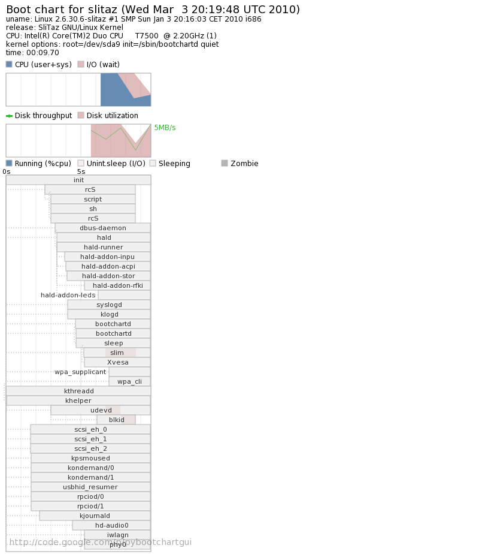

.. http://doc.slitaz.org/en:guides:boottime
.. en/guides/boottime.txt · Last modified: 2010/08/22 23:06 by linea

.. _boottime:

Boot time
=========

SliTaz boots fast!
But most likely you haven't turned super fast boot on yet.
To do this, just edit your :file:`/etc/rcS.conf`:

.. code-block:: shell

   FAST_BOOT_X="yes"

Remove ``dbus``, ``hald`` and ``slim`` from the ``RUN_DAEMONS`` array.
That's all.
Note, on some machines, ``FAST_BOOT_X`` may not boot properly.
However, if Xvesa/Xorg works after you enable this feature, it's safe to leave it on.

Now, how do you measure the boot time?
SliTaz logs time that rcS scripts take to run in the :file:`/var/log/boot-time` file.
In my case, it shows 5 secs.

But, how do you graph your full boot process (including the kernel-boot time)?
Its quite easy on SliTaz.
Just do and install the following:

.. code-block:: console

   # tazpkg get-install pybootchartgui

:program:`Pybootchartgui` will then create a chart automatically in :file:`/var/log`.

Now, just edit your :file:`menu.lst` file for grub and add ``init=/sbin/bootchartd``.
In my case, it's like this::

  title slitaz with bootchart
  root (hd0,8)
  kernel /boot/vmlinuz-2.6.30.6-slitaz root=/dev/sda9 init=/sbin/bootchartd quiet

Here's my boot chart with WPA2 Wi-Fi (under 10 secs boot time on a laptop with hard disk).
This is out-of-the-box!!!

   My bootchart
