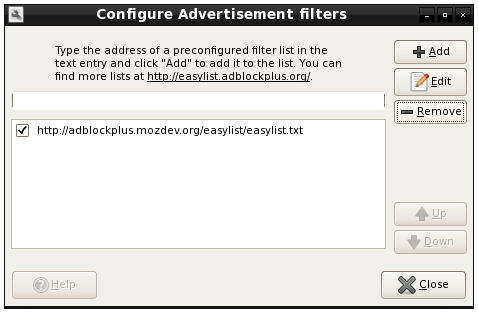
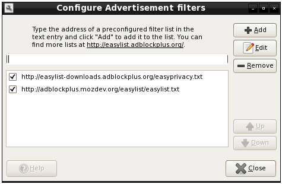
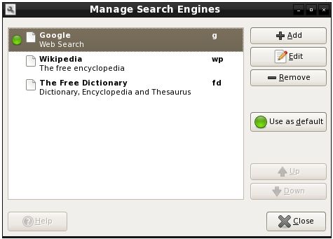
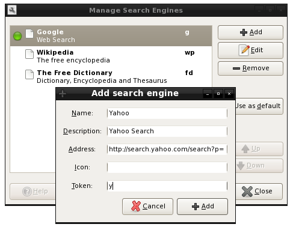
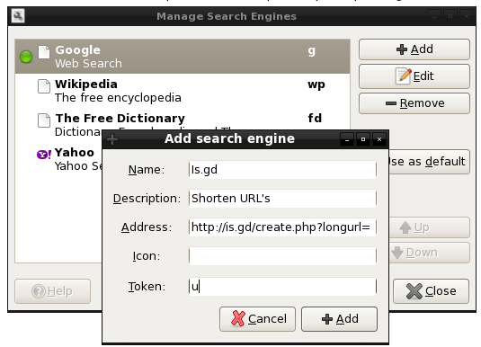
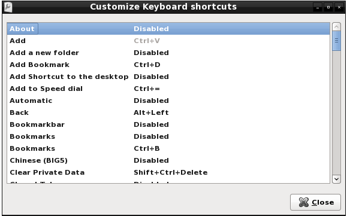

.. http://doc.slitaz.org/en:guides:midori
.. en/guides/midori.txt · Last modified: 2011/04/19 07:11 by godane

.. _midori:

Midori Tips & Tweaks
====================

I am writing this guide since :program:`Midori` is the default browser in SliTaz 3.
Your first thought may be to install :program:`Firefox` and not giving :program:`Midori` a try because it lacks features.
I thought it lacked features or Addon's also until I dug around some.
If you want to know the history of :program:`Midori` visit it's Wiki page: `Midori Wiki <http://en.wikipedia.org/wiki/Midori_(web_browser)>`_.

Things that I will cover:

* Ad Blocking
* Custom Search Engines
* Flash Blocking
* UserScripts
* Shortcuts

Enabling Extensions
-------------------

Upon opening :program:`Midori` click on the :guilabel:`Tools Menu`, Go down to :guilabel:`Extensions` and click on it.
This should open up a "panel" that displays boxes that you can check to enable different Extensions or Options.
Check only the boxes you wish to enable.
I would enable :guilabel:`Statusbar Features` and :guilabel:`Toolbar Editor` right now.
Everything involving those two should be self explantory.
So no need for a "HowTo".
I would tell you what other things to enable right now, but if someone adds to this wiki then this paragraph would need to be edited.
So if anything needs to be enabled it will be mention it as it go along.

Ad Blocking
-----------

In extensions enable: Advertisement blocker

Most people like ad blocking that :program:`FireFox` has through an extension called Adblock Plus (ABP).
Well :program:`Midori` has an adblocker that uses the well known "easylist" from ABP.
Now that you have it enabled we need to edit it.
Click on the :guilabel:`Tools Menu`, now click on :guilabel:`Configure Advertisement filters`.
This should now open a box looking like this:

From the picture you can see that adding a ruleset is pretty self explanatory.
As an example click on :guilabel:`Add`, then insert this URL: http://easylist-downloads.adblockplus.org/easyprivacy.txt

That is what it should now look like.
Now to block a single image just right click the image on the page you want to block.
Go down to :guilabel:`Block Image` and click :guilabel:`Add`.
Now that image is blocked.

Managing Search Engines
-----------------------

No extension needs to be enabled for this feature.

This is one of my favorite things in any browser.
I use this for other things then just search engines.
I will share that later.
Click on the "Tools Menu", then click on "Manage Search Engines".
Just like Ad blocking you should get a box to pop up that looks like this:

Since I don't really use anything else but google I am just going to add Yahoo! as an example of how to add it and use it.
Click add and fill it in to look like this:

Once that is done go up to the URL bar in midori and type: "y slitaz linux" without the quotes.

.. figure: http://img30.yfrog.com/img30/6048/yslitazlinux.png
..
.. Example:y slitax linux.

After pressing :kbd:`Enter` you should now see the Yahoo search results for *slitaz*.

.. figure: http://img402.yfrog.com/img402/2932/yslitazresults.png
..
.. Yahoo Results

Typing "g slitaz" again without the quotes would give you the google results for SliTaz.

Here is what I use it for besides search engines.
In Opera when you bookmark something you can make a nickname for the site.
I have the letters: ``fs`` for http://forum.slitaz.org.
So I just type "fs" without the quotes in the URLbar to go to SliTaz's forum.
Now I don't see this feature in Midori so I just make a custom search engine like I did for Yahoo!.
I am not really adding a search just using it as a shortcut.
I think for the pictures I added that it is self explanatory how to add any site you want to make a shortcut for.

For all you Twitter users or people that like shortened URLs.
Add this to custom searches::

  http://is.gd/create.php?longurl=

I give mine the Token letter "u".
When I have a big URL I want to shorten, I go to the URL bar, go to the left of the "http" in the URL, then I type "u".
Then press :kbd:`Space` then :kbd:`Enter` it takes me to that site and shortens the URL.
Example:

.. figure: http://img260.yfrog.com/img260/6982/shorten.png
..
.. Shortening URL

Result:

.. figure: http://img30.yfrog.com/img30/6563/shortened.png
..
.. Shortened URL

For those who hate using the mouse like me and want to shorten URL's you can do the same thing above like this:

:kbd:`Ctrl`\ +\ :kbd:`L`, :kbd:`←`, type u, :kbd:`Space`, then :kbd:`Enter`

If you have javascript enabled then the shortened URL should already be highlighted.
So a quick :kbd:`Ctrl`\ +\ :kbd:`C` should copy it for you.

Flash Blocking
--------------

To flashblock you need to use a userscript.
UserScripts are just custom javascripts to do a range of things.
I will cover other UserScripts later in this wiki but flashblock is more then likely gonna be the only one anyone will use.

First we need to make a folder if you don't already have it: :file:`/home/{tux}/.local/share/midori/scripts`.
"tux" is just used as an example.
If you have a different user name then change accordingly.

These pictures are kind of big so I am just linking to them.
Example before FlashBlock:

.. figure: http://img180.yfrog.com/img180/7269/blocked.png
..
.. Flash Blocked

Now go to: `Flashblock Wannabe <http://rightfootin.blogspot.com/2009/04/flashblock-wannabe.html>`_.
Download :file:`FlashBlock.user.js.txt` (remove the :file:`.txt` extension) to the folder we just created.
Go to the :guilabel:`Tools Menu`, and click on :guilabel:`UserScripts`.
You should now see "FlashBlock Wannabe".
Make sure there is a checkmark next to it.
Sometimes the UserScripts show up right away and other times they don't so I just restart :program:`Midori` to view the UserScripts.
So if it isn't showing then just restart :guilabel:`Midori`.
Now you should have flash blocked unless you click on it like the flashblocker addon for :program:`FireFox`.
It should look like this:

.. figure: http://img541.yfrog.com/img541/2801/notblocked.png
..
.. Flash Unblocked

User Scripts
------------

If you already did the Flashblocking part then this should be as easy as downloading them and putting them in the correct folder.
No big HowTo here I will just show you some examples of the ones I use and what they do.

`Linkify <http://userscripts.org/scripts/show/1352>`_: If you have ever been to a site or forum and someone posted a link that is just text and not clickable then this is for you.
It makes all "http" links clickable.
It saves you from highlighting and copying and pasting links to a URL bar.

`Google Image Redirector <http://userscripts.org/scripts/show/5059>`_: If you ever google search for images and click on an image you will notice that it take you to the page but the tiny image is in a frame.
This userscript takes you directly to the actual image.
Saves you a couple clicks of the mouse.

`Google Show Options <http://userscripts.org/scripts/show/72270>`_: Last year google added advanced search options in results.
You could click on the "Show Options" and it would list them.
This bypasses clicking on it and it shows it right away without have to click it.

`Just Show Images <http://userscripts.org/scripts/show/54108>`_: If you have ever clicked on a link from a forum or anything to certain image hosting sites you would notice all the ads.
This UserScript just shows the picture you want and little else.

`Easy YouTube Downloader <http://userscripts.org/scripts/show/54790>`_: If you would like to download the video from YouTube without going to a seperate site, you can use this script.
It adds a download option for multiple video formats on the screen.

Shortcuts
---------

In extensions enable: shortcuts

I try to use the mouse as little as possible.
So shortcuts come in handy.
Here is how to view and/or edit them to your taste.
Open up the :guilabel:`Tools Menu` go down to and click on :guilabel:`Customize Shortcuts`.
You will get a popup that looks like this:

In the picture you will see an action along with an assigned "shortcut".
Some show an action but are disabled.
I will show you how to change a "shortcut" or to enabled one that is disabled.
To assign a "shortcut" click on what you would like to change to highlight.
Now go to the right and click the mouse where the "shortcut" or word "disabled" is and click.
It should change the text to :guilabel:`New accelerator…`.
Now all you have to do is press a combination of keys you would like to make up your shortcut.
Popular choices to start your shortcut with are any of these:

:kbd:`Ctrl`, :kbd:`Alt`, or either :kbd:`Win` keys

Winkeys will be either "Super L" or "Super R" depending on which you press.
Not every keyboard has a "Winkey" or only has just one.
I prefer to use the :kbd:`F1` to :kbd:`F12` keys.
Here is an example of some of my shortcuts:

.. list-table::

   * - Show/Hide Sidepanel
     - :kbd:`F2`
   * - Show/Hide Bookmarkbar
     - :kbd:`F3`
   * - Show/Hide Menubar
     - :kbd:`F4`
   * - Refresh
     - :kbd:`F5`
   * - Preferences
     - :kbd:`F7`
   * - Focus Current Tab
     - :kbd:`F9`
   * - Full Screen
     - :kbd:`F11`
   * - Bookmarks
     - :kbd:`Ctrl`\ +\ :kbd:`B`
   * - Add Bookmarks
     - :kbd:`Ctrl`\ +\ :kbd:`D`
   * - Homepage
     - :kbd:`Ctrl`\ +\ :kbd:`H`
   * - Highlight URLbar
     - :kbd:`Ctrl`\ +\ :kbd:`L`
   * - Close Tab
     - :kbd:`Ctrl`\ +\ :kbd:`W`
   * - Next Tab
     - :kbd:`Ctrl`\ +\ :kbd:`PgDn`
   * - Previous Tab
     - :kbd:`Ctrl`\ +\ :kbd:`PgUp`

Just wanted to add that if you want to "disable" a shortcut.
Pressing :kbd:`Backspace` in :guilabel:`New accelarator…` will disable it.
