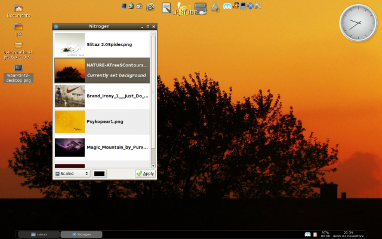

.. http://doc.slitaz.org/en:guides:sexydesktop
.. en/guides/sexydesktop.txt · Last modified: 2010/08/22 23:09 by linea

.. _sexydesktop:

Sexy desktop apps and config
============================

Introduction
------------

This page provides information about creating a beautiful desktop, available applications via the SliTaz package manager and configuration file examples or tweaks.
Wbar and Tint2 desktop

First install the used packages:

* :program:`wbar`
* :program:`tint2`
* :program:`nitrogen`
* :program:`cairo-clock`

We have to create, modify or configure 3 files in your personal home directory (click on the link to download files or check the bottom of the page):

* :file:`~/.wbar`
* :file:`~/.config/tint2/tint2rc`
* :file:`~/.config/openbox/autostart.sh`

:program:`Wbar` and :program:`Tint2` configuration files don't exist if you've never started the applications before, but :program:`Openbox` autostart scripts should exist since it is the default Window Manager on SliTaz.
Save the attached config files and put them in the correct directory.

The *Cairo analog desktop clock* needs the "Composite" extension enabled and a *composite manager* running (both activated by default on SliTaz).
If you use Xorg you must adjust your :file:`xorg.conf` file.
The *composite manager* we use in SliTaz is called :program:`xcompmgr`, it is light and has some command line options for shadows, etc.

To automatically execute all applications when your X session starts you must edit the :program:`Openbox` autostart script with your favorite editor or use the GUI :command:`$(desktopbox autostart)` to add the following lines:

.. code-block:: shell

   # Start the Freedesktop standard menu panel.
   #lxpanel &
   
   # Tint2 - Simple and clean panel.
   tint2 &
   
   # Desktop Wallpaper with Nitrogen.
   nitrogen --restore &
   
   # Desktop effects composer (xcompmgr -c -r 10 &).
   xcompmgr &
   
   # Wbar icons panel.
   (sleep 4 && wbar -above-desk -bpress -pos top center -isize 24 -jumpf 0 -zoomf 2.0 -balfa 0) &
   
   # Nice clock for the desktop.
   (sleep 2 && cairo-clock) &

Make sure to comment out ``lxpanel`` and modify :program:`PCManFM` preferences to let :program:`Nitrogen` handle the desktop background.
To choose your image:

.. code-block:: console

   $ nitrogen /usr/share/images

Now logout and login again into your customized desktop.
Or kill the current process and then restart the applications:

.. code-block:: console

   $ killall lxpanel
   $ tint2 &
   $ wbar -above-desk -bpress -pos top center -isize 24 -jumpf 0 -zoomf 2.0 -balfa 0 &

* `Link to download .wbar file <http://savedonthe.net/download/185/dot.html>`_
* `Link to download tint2rc file <http://savedonthe.net/download/186/tint2rc.html>`_
