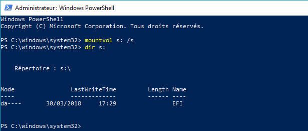
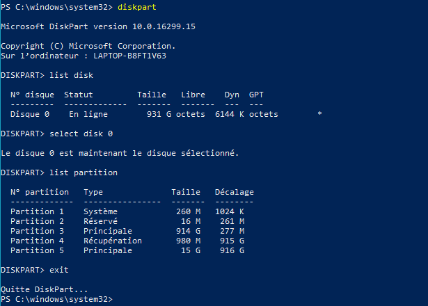
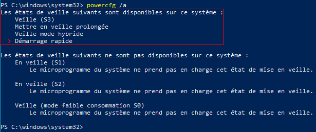
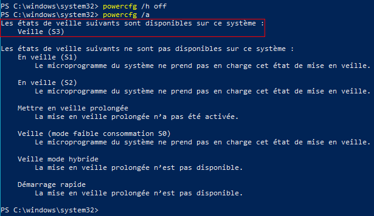
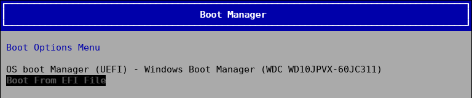
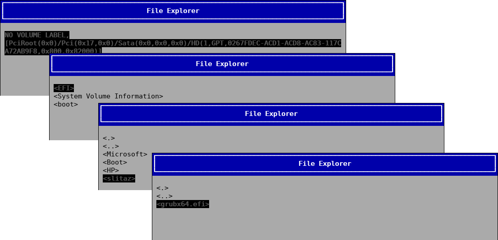

.. http://doc.slitaz.org/en:guides:uefi-frugal
.. en/guides/uefi-frugal.txt · Last modified: 2018/05/12 19:01 by linea

.. _uefi frugal:

HOWTO do a frugal installation on a computer in UEFI boot mode
==============================================================

Introduction
------------

Arun Prakash Jana has `already described <http://tuxdiary.com/2014/04/13/boot-slitaz-in-uefi-mode/>`_ how to install SliTaz in frugal mode on an UEFI computer.
But he did install the kernel and the rootfs in the ESP partition.

IMHO, the ESP partition should be reserved for boot loaders and no operating system or software should be installed in it.
This document explains how to do a frugal install of SliTaz Next (32bit) on the Windows partition, C:

.. note::
   All along this tutorial,

   * the ESP partition will be noted **(ESP)**
   * and the main partition of Windows **(C:)**.

Installing files on (C:)
------------------------

#. Start Windows and open the file manager.
#. Select (C:) and create a new directory at root; say :file:`slitaz`.
#. Open :file:`slitaz` and create a directory, say :file:`next` in it.
#. Plug your EFI LiveUSB and copy the files :file:`bzImage` and :file:`rootfs.gz` from the :file:`\\boot` directory of the Live into the :file:`\\slitaz\\next` directory of (C:).
#. Copy the boot loader — :file:`bootia32.efi` for a 32bit EFI system (or :file:`bootx64.efi` for a 64bit EFI system) — from the :file:`\\efi\\boot` directory of the Live into the :file:`\\slitaz\\next` directory of (C:).

.. note::
   If you didn't copy files from your EFI LiveUSB but extracted them from an ISO file, pay attention that Windows may truncate files names or/and extensions and will use uppercase.

   It doesn't matter that the characters are uppercase or lowercase in NTFS or FAT partitions.
   But it'll be more consistent if you rename files with their exact name and extensions and respecting the case.

Installing the boot loader
--------------------------

The boot loader must be installed in (ESP); this partition is not mounted at boot and is hidden.

Mount (ESP): from Windows 8/10, right-click on the :guilabel:`Home button` in the bottom left corner of the screen.
In the context menu that opens, select :guilabel:`Windows PowerShell (admin)`.
The :guilabel:`User Account Control` will warn you that Windows PowerShell wants to modify the system; confirm by clicking :guilabel:`YES`.

.. note::
   Note that Windows

   * uses ``\`` and ``/`` where Linux respectively uses ``/`` and ``-``
   * and doesn't do any differences between uppercase and lowercase.

In the admin terminal, type:

.. code-block:: doscon

   mountvol s: /s

You can check (ESP) is correctly mounted listing the directories and files it contains:

.. code-block:: doscon

   dir s:

Create a directory, say :file:`slitaz`, in the EFI directory of (ESP)

.. code-block:: doscon

   mkdir s:\efi\slitaz

Copy the boot loader into it.

* For a 32bit EFI computer, type:

  .. code-block:: doscon

     move \slitaz\next\bootia32.efi s:\efi\slitaz\grubia32.efi

* For a 64bit EFI computer, type:

  .. code-block:: doscon

     move \slitaz\next\bootx64.efi s:\efi\slitaz\grubx64.efi

Note we have renamed the file; this is not a necessity but it'll help to you remind that SliTaz is launched with GRUB 2.

Configuration file for GRUB 2
-----------------------------

Create a :file:`\\boot\\grub` directory in (ESP)

.. code-block:: doscon

   mkdir s:\boot\grub

Create the configuration file:

.. code-block:: doscon

   notepad s:\boot\grub\grub.cfg

Example::

  ### CONFIGURATION FILE FOR GRUB 2 ###
  #
  
  # Comment the line if you want SliTaz to start immediately or
  # change the value to define the time (seconds) to wait before booting.
  set TIMEOUT=-1
  
  # Menu 0: SliTaz Next (ISO 20170930 - kernel 4.9.30)
  menuentry "SliTaz Next - frugal install" {
     set root=(hd0,3)
     linux /slitaz/next/bzImage ro root=/dev/null video=-32 autologin
     initrd /slitaz/next/rootfs.gz
  }

This config file considers (C:) is ``(hd0,3)``: the third partition of the first hard disk, this is generally the case.
To verify what the main partition of Windows is, run the :program:`Diskpart` utility; ask for the ``list`` of the disks, ``select`` the Windows disk and ``list`` its partitions:

Unmount (ESP):

.. code-block:: doscon

   mountvol s: /d

Disabling the fast startup
--------------------------

.. warning::
   Remember: you MUSN'T access (C:) as long as you haven't disabled the fast startup of Windows!

Check if the fast startup is enabled (default); in the admin terminal, type :command:`powercfg /a`:

   The fast startup is **enabled**.

   *(Sorry for french screens; feel free to replace them with english version. Thanks.)*

To disable the fast startup, type :command:`powercfg /h off`.
Check the fast startup is really disabled by typing :command:`powercfg /a` again:

   The fast startup is **disabled**.

You didn't think it was possible but now yes, Windows will boot even more slowly than before…

Configuring the computer (Setup)
--------------------------------

You don't have anything else to do than to disable the *Secure Boot*.
You've already did it when you created your EFI LIveUSB.

If you came directly to this tutorial without doing an EFI LiveUSB, see step :ref:`uefi live configuring the computer` of :ref:`uefi live`.

Run SliTaz
----------

Reboot the computer and access the Multiboot mode.
On the **hp** Laptop 17-bs032, press the :kbd:`F9` key immediately after you've powered on the computer until the *Boot Manager* displays the list of the disks where it found a :file:`bootx64.efi` file in a :file:`\\EFI\\BOOT` of a FAT32 partition:

Select :guilabel:`Boot From EFI File`.
The *EFI File Explorer* displays the list of the volumes found; select your hard disk then :menuselection:`EFI --> slitaz --> grubx64.efi` to run GRUB 2.

.. note::
   If you don't know how to access the Multiboot menu, have a look `here <https://doc.ubuntu-fr.org/tutoriel/modifier_ordre_amorcage_du_bios#liste_des_touches_pour_acceder_au_bios_et_au_boot_menu>`_).

Congratulations and Welcome to SliTaz Next!

.. tip::

   **Want to test the latest ISOs of SliTaz without having to do changes to (ESP)?**

   Add a generic entry in your :file:`grub.cfg`; ie::

     # Menu 1: boot Slitaz from ISO file
     menuentry "SliTaz - LiveISO" {
        loopback taziso (hd0,3)/slitaz/slitaz.iso
        linux (taziso)/boot/bzImage ro root=/dev/null video=-32 autologin
        initrd (taziso)/boot/rootfs.gz
     }

   Download the ISO to test in :file:`c:\\slitaz`, renaming it :file:`slitaz.iso`.

We now know enough to proceed to a full installation of SliTaz in dual boot with Windows 8/10.
