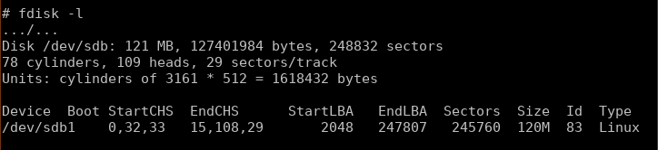
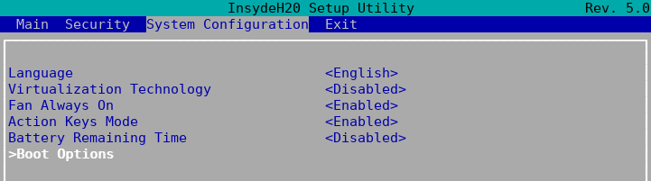
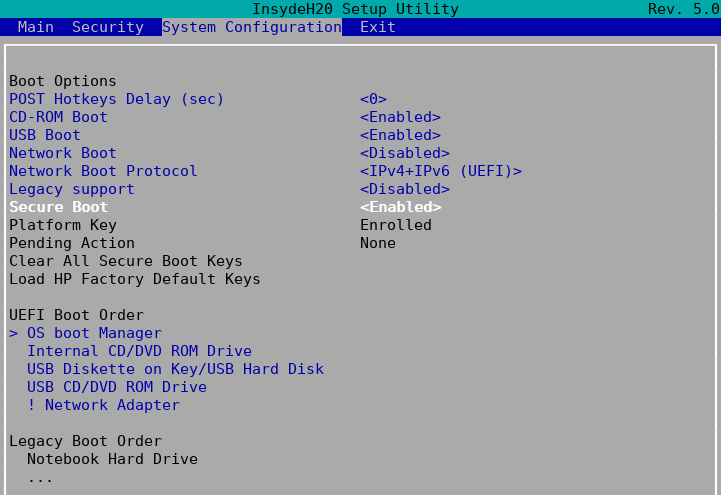
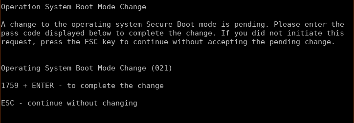

.. http://doc.slitaz.org/en:guides:uefi-live
.. en/guides/uefi-live.txt · Last modified: 2018/05/17 00:26 by ceel

.. _uefi live:

HOWTO do a SliTaz LiveUSB for EFI computers
===========================================

:author: ceel, linea

Here starts my trilogy about UEFI & SliTaz ;-)

This first tutorial describes how to do an EFI LiveUSB of SliTaz Next from a SliTaz Rolling session.

It doesn't matter that the operating system is 32bit or if your EFI computer is 64bit.
The only imperative is a 64bit computer needs a 64bit EFI boot loader to start.

.. contents::
   :local:

Preparing the USB stick
-----------------------

Insert a USB stick; if your file manager is set to mount removable media automatically when they are inserted, unmount the stick but don't eject it.

Open a terminal as the root user and change in :file:`/root`:

.. code-block:: console

   tux@slitaz:~$ su
   Password: 
   root@slitaz:/home/tux# cd /root
   root@slitaz:~# 

Identify the stick:

.. code-block:: console

   # fdisk -l

.. important::
   All the commands in the rest of this document will assume your stick is identified as :file:`sdb1`.

   If not, **replace all sdb1** occurrences with your device identification, ie: :file:`sdc1`.

If the stick is not FAT32, format it (the packages :program:`dosfstools` and :program:`mtools` must be installed on your system):

.. code-block:: console

   # mkfs.vfat /dev/sdb1

.. important::
   Don't forget to indicate the partition number.

   **All the data on the partition sdb1 will be destroyed.**

Set the flags ``boot`` and ``lba`` to your stick:

.. code-block:: console

   # parted /dev/sdb set 1 boot on
   # parted /dev/sdb set 1 lba on

*Don't pay attention to the messages*
Information: You may need to update :file:`/etc/fstab`.

Creating the LiveUSB
--------------------

Download the `SliTaz Next ISO <http://mirror1.slitaz.org/iso/next/slitaz-next-170930.iso>`_.

.. code-block:: console

   # wget http://mirror1.slitaz.org/iso/next/slitaz-next-170930.iso

Here are two possibilities: use :program:`tazusb` or copy the files manually.

Using tazusb
^^^^^^^^^^^^

In the terminal, type:

.. code-block:: console

   # tazusb gen-iso2usb slitaz-next-170930.iso /dev/sdb1

When :program:`tazusb` has finished the job, exit and mount the stick:

.. code-block:: console

   # exit
   # mount /dev/sdb1 /mnt

Go to :ref:`installing an efi boot loader` step.

Copying files manually
^^^^^^^^^^^^^^^^^^^^^^

Mount the stick:

.. code-block:: console

   # exit
   # mount /dev/sdb1 /mnt

Mount the ISO file:

.. code-block:: console

   # mount -o loop slitaz-next-170930.iso /media/cdrom

Copy the files to the stick:

.. code-block:: console

   # cp -r /media/cdrom/boot /mnt

Unmount the ISO:

.. code-block:: console

   # umount /media/cdrom

.. _installing an efi boot loader:

Installing an EFI boot loader
-----------------------------

Create a :file:`/efi/boot` directory on your stick:

.. code-block:: console

   # mkdir -p /mnt/efi/boot

We are going to install :program:`GRUB` 2 but it exists on other boot loaders compatible with EFI.

32bit EFI systems
^^^^^^^^^^^^^^^^^

Install the :program:`grub2-efi` package:

.. code-block:: console

   # tazpkg -gi grub2-efi

Copy the boot loader in the :file:`/efi/boot` directory you previously created on your stick:

.. code-block:: console

   # cp /boot/efi/boot/bootia32.efi /mnt/efi/boot/bootia32.efi

64bit EFI systems
^^^^^^^^^^^^^^^^^

Download the `bootx64.efi <http://cook.slitaz.org/next64/grub2/browse/taz/grub2-efi-2.02/fs/boot/efi/boot/bootx64.efi>`_ file from the Next64 project.

.. code-block:: console

   wget http://cook.slitaz.org/next64/grub2/browse/taz/grub2-efi-2.02/fs/boot/efi/boot/bootx64.efi

Copy the boot loader in the :file:`/efi/boot` directory you previously created on your stick:

.. code-block:: console

   # cp bootx64.efi /mnt/efi/boot/bootx64.efi

Configuration file for GRUB 2
-----------------------------

Create a :file:`/boot/grub` directory on your stick:

.. code-block:: console

   # mkdir -p /mnt/boot/grub

With your preferred text editor (ie :program:`nano`), create a configuration file for :program:`GRUB` 2:

.. code-block:: console

   # nano /mnt/boot/grub/grub.cfg

Example::

  ### CONFIGURATION FILE FOR GRUB 2 ###
  #
  
  # Comment the line if you want SliTaz to start automatically at boot or
  # change the value to define the time (seconds) to wait before booting.
  set TIMEOUT=-1
  
  # Menu 0: boot SliTaz Next
  menuentry "SliTaz Next (ISO 20170930 - kernel 4.9.30)" {
     set root=(hd0,1)
     linux /boot/bzImage ro root=/dev/null video=-32 autologin
     initrd /boot/rootfs.gz
  }

.. tip::
   Add your keyboard configuration in the linux line; ie for a french keyboard::

     linux /boot/bzImage ro root=/dev/null video=-32 kmap=fr-latin1 autologin

Unmount the stick:

.. code-block:: console

   # umount /mnt

Your Live is ready.
But maybe the hardest remains to do.

.. _uefi live configuring the computer:

Configuring the computer
------------------------

Computers that came with Windows 8 / Windows 10 preinstalled start in **Boot mode** = UEFI and have the **Secure boot** = Enabled.
The **Secure boot** prevents the loading of drivers or OS loaders that are not signed with a digital signature ($old by Microsoft).

With SliTaz not having any digital signatures, you have to disable the secure boot.
The following lines describe how to do it on a **hp** Laptop 17-bs032 but it can be different for you; there are almost as many ways as there are manufacturers…
:-/

Even access to the :guilabel:`Setup` is different from one computer to another.
If you don't know how to access the setup, have a look `here <https://doc.ubuntu-fr.org/tutoriel/modifier_ordre_amorcage_du_bios#liste_des_touches_pour_acceder_au_bios_et_au_boot_menu>`_ (sorry for French; I couldn't find an equivalent link in English).

On the **hp** Laptop 17-bs032, press the :kbd:`F10` key immediately after you've powered on the computer until the BIOS Setup Main page is displayed.
Use the right arrow to display the :guilabel:`System Configuration` page.

Select :guilabel:`>Boot Options`

.. warning::
   Don't modify Setup parameters if you don't understand what you are doing!

   If you're not sure or don't remember what you've done/changed, Exit Setup without saving!

Select :guilabel:`Secure Boot` and set it to :guilabel:`Disabled`.
Then, in :guilabel:`UEFI Boot Order`, place :guilabel:`USB Diskette on Key/USB Hard Disk` at the top of the list.

.. tip::
   If you prefer not to change the UEFI Boot Order, you can use the Multiboot feature to boot your LiveUSB.

Exit Setup saving changes; the **hp** Laptop 17-bs032 reboots and prompts you to confirm your changes:

Well, it wasn't so hard.
But we'll see when proceeding at the full installation on an acer Aspire v3-111p that it is quite different.

Run your Live
-------------

.. warning::
   Windows 8 & 10 use both the **Fast Startup**.
   This feature consists to store the entire configuration in a file named :file:`hiberfil.sys` when you shutdown the computer.
   At next boot Windows will load the file; this is faster than to load all the drivers.

   When Linux finds an :file:`hiberfil.sys` file, it refuses to mount the partition.
   If you still try to access to the partition and worst if you wrote on it, you can corrupt the file system and Windows won't start anymore.
   **You must disable the Fast Startup if you want to access your hard disk!**
   But this HOWTO is already long enough; we will see this in the second part of UEFI and SliTaz.

Insert your Live in a USB port and restart the computer.

If you didn't modify the :guilabel:`UEFI Boot Order`, access the Multiboot menu.

If you don't know how to access the Multiboot menu, have a look `here <https://doc.ubuntu-fr.org/tutoriel/modifier_ordre_amorcage_du_bios#liste_des_touches_pour_acceder_au_bios_et_au_boot_menu>`_).

.. tip::
   **Want your 32bit Live to boot as well as on 32bit computers than 64bit computers?**

   Copy :file:`bootia32.efi` **and** :file:`bootx64.efi` in the :file:`/efi/boot` directory of the Live!

   **Cherry on the cake!**

   Plug your Live in a non EFI computer and… yes it boots too!
   Well, at least on a Fujitsu E Series…

   And on very old 32bit computers — *like Pentium 4* — if you've used :program:`tazusb`, your Live will boot with :program:`Syslinux` and though the stick is FAT32, it will be mounted at boot and :file:`/home/tux` will be created giving you persistence.
   :)

   **Want to enjoy the memory beyond 4GB?**

   Create a LiveUSB with `Rolling core64 <http://mirror1.slitaz.org/iso/rolling/slitaz-rolling-core64.iso>`_.

   I never succeeded to boot it in graphics mode on the two UEFI computers I tested probably because some drivers are missing in Rolling.
   But alanyih `did it <http://forum.slitaz.org/topic/slitaz-uefi#post-46187>`_.
   :)

You are now ready for a frugal install.
Click :ref:`uefi frugal`!
