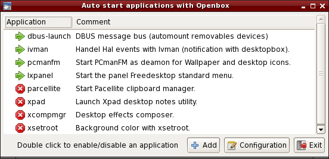
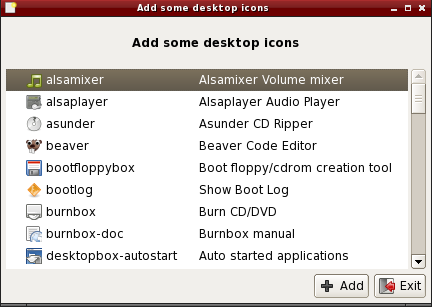

.. http://doc.slitaz.org/en:handbook:desktop
.. en/handbook/desktop.txt · Last modified: 2012/06/15 20:37 by linea

.. _handbook desktop:

Desktop
=======

Introduction
------------

The default SliTaz desktop is brought to you using different components of the LXDE project.
:program:`Openbox`, :program:`PCmanFM` and :program:`LXPanel` combine to implement a Desktop providing simplicity and functionality.

Openbox
-------

:program:`Openbox` is a fast, lightweight, simple, themeable window manager, it is the window manager by default on SliTaz.
A window manager is an application that runs on top of the X server to control the appearance of windows.
It can then place, cut and re-size windows at will.

:program:`Openbox` provides a context menu via a right click on the desktop, this menu can be changed by editing a configuration file.
The key combinations :kbd:`Alt`\ +\ :kbd:`Tab` allow you to list and navigate through open windows.
:program:`Obconf` can be used to graphically configure the window manager and various small tools (specific to SliTaz) allow you to have a simple, stylish and coherent desktop.
By default, SliTaz uses 2 virtual desktops.

The Desktop provided by SliTaz complies with the Freedesktop standards, the file manager :program:`PCmanFM` allows for management of desktop icons, drag and drop and the mounting of devices with a solitary click.
The panel menu, taskbar, icons, etc are powered by :program:`LXpanel`.

Configuring Openbox
-------------------

Most options can be configured graphically using the :program:`Obconf` utility located in the "Preferences" menu.
The configuration file can also be modified using your favorite text editor, this is located in your home directory :file:`~/.config/openbox/rc.xml` and is a XML file.
The keyboard shortcuts are defined in the ``<keyboard>`` section of the configuration file.

Themes
------

:program:`Openbox` supports themes through a single file using syntax specific to the window manager.
Several default themes are provided, they can be selected via :program:`Obconf` and are found in :file:`/usr/share/themes`.
Each system user can install their own themes in the directory :file:`~/.themes` either manually or via :program:`Obconf`.
If you want to create your own themes for SliTaz, then the easiest way is to copy and rename an existing theme and then edit the file :file:`themerc`.
Optional themes can also use images for buttons, icons, etc.
These images can be created or modified via an image editor such as the :program:`GIMP` or :program:`mtPaint`.

On the Internet you will find many more themes created by the :program:`Openbox` community.
More information can be found on the official :program:`Openbox` `website <http://openbox.org/wiki/Openbox:Themes>`_.

Context Menu
------------

The menu is in the file :file:`~/.config/openbox/menu.xml`.
Besides editing from a text editor, it also possible to edit this file with :program:`obmenu` (not installed by default).

Applications started automatically
----------------------------------

When starting in graphical mode, :program:`Openbox` allows many applications to start automatically via the :file:`~/.config/openbox/autostart.sh` script.
By default, using this script, SliTaz starts the file manager :program:`PCmanFM` for the management of screen and desktop icons, the panel (:program:`LXpanel`) for the menu, and :program:`DBUS` for the management of devices or media such as USB keys.
To add or remove applications launched at startup of the session, you can edit the script or use the small SliTaz GUI located in the menu :menuselection:`Preferences --> Auto started applications`:

Wallpaper and icons using PCmanFM
---------------------------------

:program:`Openbox` doesn't manage the screen natively, you can use an external tool, this allow more freedom of choice.
The default desktop on SliTaz uses the file manager :program:`PCmanFM` to display pictures as wallpaper and have desktop icons.
Alternatively, you can use the package :program:`hsetroot` to display a picture or :program:`xsetroot` for a solid color.
:program:`PCmanFM` is started with the :program:`Openbox` session as a daemon; ie, it runs in the background and launches faster.
To change the current background image, you can go through the file manager preferences or via the menu :menuselection:`Preferences --> Wallpaper`.

The icons are displayed via a simple text file (:file:`.desktop`), following the Freedesktop standards, you can create your own or customize using your favorite text editor.
To add icons to the desktop, SliTaz provides a tiny graphical box accessible via the menu :menuselection:`Preferences --> Desktop icons` or alternatively, you can use the :program:`Openbox` context menu :menuselection:`Desktop files & Icons --> Add new icon`:

LXPanel
-------

:program:`LXPanel` forms part of the LXDE project and handles the taskbar, menus, icons etc.
Menus are dynamically generated by adding :file:`.desktop` files to the :file:`/usr/share/applications` or :file:`~/.local/share/applications` directory.

The system configuration file is located in :file:`/etc/lxpanel` and can also be stored locally in :file:`~/.config`, though it is recommended that you configure :program:`LXPanel` graphically by using the :guilabel:`Panel Settings` (right click) entry on the taskbar.

Panel Preferences
^^^^^^^^^^^^^^^^^

The :program:`LXPanel` configurator has 4 tabs:

* :guilabel:`Geometry` handles the position, icons, and size — either dynamic or fixed of the panel.
* :guilabel:`Appearance` adjusts the background and fonts.
* :guilabel:`Panel Applets` lets you add, remove, edit and move plugins around on the panel.
* :guilabel:`Advanced` allows you to set preferred applications like the file manager, terminal and logout command.

The official website for the LXDE project and :program:`LXPanel` can be found `here <http://lxde.org/>`_.

Visual effects
--------------

SliTaz provides several tiny tools to give effects to the :program:`Openbox` windows and menus.
You can have transparent windows or use shadows to create depth on the Desktop.
The effects are achieved via :program:`xcompmgr` (composite manager) and :program:`transset-df` (transparency) and both can be activated at the same time on the session using the :program:`Openbox` context menu :guilabel:`Desktop Effects`.
