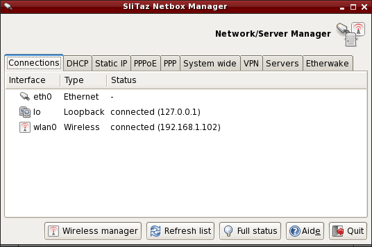
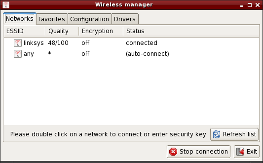

.. http://doc.slitaz.org/en:handbook:networkconf
.. en/handbook/networkconf.txt · Last modified: 2019/10/16 19:11 by mojo

.. _handbook networkconf:

Network Configuration
=====================

:author: jozee, linea, domcox, emgi, genesis, mojo

.. important::
   SliTaz Panel/Network replaces :program:`netbox` for SliTaz-4.0 and newer

About the Network
-----------------

By default SliTaz starts a DHCP client (:program:`udhcpc`) on ``eth0`` at boot time.
If your network card has been identified as an ``eth0`` interface and you use a router, your connection should already be working.
DHCP is dynamically configured, on each boot the client asks for a new IP address from the DHCP server which is integrated into the router, or on another computer.
If you need a static IP, you can directly edit config files or use the :guilabel:`Network` tab at :menuselection:`System Tools --> Slitaz Panel`.
In a terminal or a Linux console, you can list all available network interfaces with the command :command:`ifconfig` followed by the ``-a`` option:

.. code-block:: console

   $ ifconfig -a

To display the Kernel's IP routing table, you can use the :command:`route` command without any arguments:

.. code-block:: console

   $ route

The system wide network configuration file is :file:`/etc/network.conf`.
It can be graphically configured at the :guilabel:`Network` tab on SliTaz Panel or directly edited by the root administrator.

Netbox — Configure the network (SliTaz 3.0 and older)
-----------------------------------------------------

:program:`Netbox` is a small GTK+ application to configure a network interface using DCHP or a fixed (static) IP address.
The tabs can be used to start/stop the connections and automatically change the values in the system files.
:program:`Netbox` provides a system wide tab from which you can directly edit network configuration files, and tabs to configure PPP/PPPoE username/passwords.
Servers such as SSH, DHCP, PXE, DNS, etc can also be configured and it's possible to create your own virtual private network (VPN) using the tools provided.

You can start :program:`netbox` from the :menuselection:`System tools` menu or via a terminal:

.. code-block:: console

   $ subox netbox

.. important::
   SliTaz-4.0 and newer:

   :program:`wifi-box` was renamed to :program:`wifibox`

   :menuselection:`SliTaz Panel --> Network --> Wireless` offers same configuration

   SliTaz-5.0 offers :program:`slitaz-config` Wi-Fi configuration using :program:`ncurses` interface.

Wifi-box — Graphical configuration of the wireless network (SliTaz 4.0 and 5.0 Weekly)
--------------------------------------------------------------------------------------

:program:`Wifi-box` is small interface to configure a network connection (Wi-Fi, WLAN, or Wireless).
The :guilabel:`Networks` tab displays a list of available networks, just double click on a network name to connect.
If the network is secure, the key will then be sought.

The :guilabel:`Favorites` tab allows you to set your preferred networks.
Once a network is added, just double click on the network name to connect.
The :guilabel:`Configuration` tab lets you configure a connection manually using the advanced settings such as the mode or channel.
The :guilabel:`Drivers` tab allows you to configure a network card; there are 3 options:

* The card is supported directly by the kernel via a module.
* The card needs a module and non-free firmware that can be installed automatically via the auto-detect tool (:program:`tazhw`).
* The card is not supported by Linux and a Windows driver must be installed via the Windows driver manager (:program:`tazndis`).

You can start :program:`wifi-box` via a terminal:

.. code-block:: console

   # wifi-box

:file:`/etc/hostname` — The hostname
------------------------------------

The file :file:`/etc/hostname` sets the machine name.
This is loaded at system startup with the command :command:`hostname`, without an argument this command returns the current machine name:

.. code-block:: console

   $ hostname

To change the hostname, you can use the :command:`echo` command or a text editor available on SliTaz (you must be root).
Example using :command:`echo` and the machine name *kayam*:

.. code-block:: console

   # echo "kayam" > /etc/hostname

:file:`/etc/network.conf`
-------------------------

:file:`/etc/network.conf` is the SliTaz system network configuration file.
It's syntax is simple and you can edit its contents with a text editor such as :program:`Nano`.
:file:`/etc/network.conf` is used by the script :file:`/etc/init.d/network.sh` to configure the network interface at boot time.

Dynamic IP — DHCP client :program:`udhcpc`
------------------------------------------

The DHCP client :program:`udhcpc` supplied with Busybox uses the :file:`/usr/share/udhcpc/default.script` to get an IP address dynamically at boot.
It supports various options which you can view with the ``--help`` option:

.. code-block:: console

   # udhcpc --help

To disable :program:`udhcpc` on ``eth0`` or modify the interface (eg ``eth1``), you must edit the :file:`/etc/network.conf` file and place the value ``"no"`` in the variable ``DHCP=``:

.. code-block:: shell

   # Dynamic IP address.
   # Enable/disable DHCP client at boot time.
   DHCP="no"

Static IP — Using a specific address
------------------------------------

You can specify a fixed IP address to configure at boot time by using the value ``"yes"`` in the variable ``STATIC=``:

.. code-block:: shell

   # Static IP address.
   # Enable/disable static IP at boot time.
   STATIC="yes"

For the configuration to work, you must specify an IP address, its subnet mask, a default gateway (gateway) and DNS server to use.
Example:

.. code-block:: shell

   # Set IP address, and netmask for a static IP.
   IP="192.168.0.6"
   NETMASK="255.255.255.0"
   
   # Set route gateway for a static IP.
   GATEWAY="192.168.0.1"
   
   # Set DNS server. for a static IP.
   DNS_SERVER="192.168.0.1"

Static routes
-------------

Static routes can be added at any time via the :command:`route add` command:

.. code-block:: shell

   route add -net 192.168.20.0 netmask 255.255.255.0 gw 192.168.21.2

The static route will remain active until the next reboot. 
In order to make these routes persistent, add them to :file:`/etc/init.d/local.sh`

PPPoE connection kernel-mode
----------------------------

PPPoE connection in kernel-mode needs 2 files.
The first file is :file:`/etc/ppp/options` where you must specify your login name::

  plugin rp-pppoe.so
  name <your_login>
  noipdefault
  defaultroute
  mtu 1492
  mru 1492
  lock

Now you have to configure :file:`/etc/ppp/pap-secrets` or :file:`/etc/ppp/chap-secrets`::

  # client      server       secret          IP addresses
  "your_login"    *          "your_password"

The config file :file:`/etc/resolv.conf` will be automatically loaded.
Finished, you can now connect to the internet with :command:`pppd`:

.. code-block:: console

   # pppd eth0

On an installed system you can start :program:`pppd` on each boot using the local startup script: :file:`/etc/init.d/local.sh`

Ethernet PPPoE ADSL Modem — PPPoE with :program:`rp-pppoe`
----------------------------------------------------------

This section is about setting up an ADSL Internet connection using an ethernet PPPoE modem in bridge mode.
To set an ASDL protocol via PPPoE, SliTaz provides the utilities package :program:`rp-pppoe`.
Using :program:`pppoe-setup` is a snap and you can quickly configure the network.
If you use DCHP it's even easier, because the server from your ISP will take care of everything.
If you do not have DHCP, you must first disable its use via ``DHCP="no"`` in the configuration file :file:`/etc/network.conf`.
It should be noted that to modify configuration files and system logs you must first become root.
To install and change the variable ``DHCP`` with :program:`Nano` (:kbd:`Ctrl`\ +\ :kbd:`X` to save & exit):

.. code-block:: console

   $ su
   # tazpkg get-install rp-pppoe
   # nano /etc/network.conf

.. rubric:: Configure with :program:`pppoe-setup`

To begin to configure your PPPoE connection, you must first open an :program:`Xterm` or Linux console and launch :command:`pppoe-setup` and then begin to answer the following questions:

.. code-block:: console

   # pppoe-setup

#. Enter your username, please note that this is the username with which you communicate with your ISP.
#. Internet interface, default is ``eth0`` unless you have more than one, in which case you will have ``eth1``, ``eth2``, etc.
   Usually the :kbd:`Enter` key is sufficient.
#. If you have a permanent ASDL link answer ``yes``, otherwise answer ``no`` (default).
#. Specify the primary and secondary DNS your ISP uses (you may have to ask).
#. Enter the password with which you communicate with your ISP (you need to enter it twice).
#. Choose the firewall settings depending on your hardware.
   If you have a router you can enter ``1`` or ``2``.
   If in doubt enter ``1``.

.. rubric:: Start and Stop the connection

Still using the command line, simply type :command:`pppoe-start` to start the connection.
A few seconds later the system tells you that it is connected.
If it gives you a message like ``TIMED OUT``, you may have poorly configured or the connection is defective.
Please check the wiring and repeat the installation from the beginning.
To start the connection:

.. code-block:: console

   # pppoe-start

To stop the connection, you can type:

.. code-block:: console

   # pppoe-stop

To check the connection status:

.. code-block:: console

   # pppoe-status

Install network card driver
---------------------------

In case you need a network card driver and don't know the driver name, you can use the command :command:`lspci` to find your card and then :command:`modprobe` to load a module.
In Live mode you can use the SliTaz boot option ``modprobe=modules`` to automatically load Kernel modules.
To get a list of all available network card drivers, display PCI eth cards and load a module:

.. code-block:: console

   # modprobe -l | grep drivers/net
   # lspci | grep [Ee]th
   # modprobe -v module_name

On an installed system you just need to add the ``module_name`` to the variable ``LOAD_MODULES`` in :file:`/etc/rcS.conf` to load your module on each boot.

.. important::
   SliTaz-4.0 and newer: :file:`/etc/firewall.conf` is moved to :file:`/etc/slitaz/firewall.conf`

   :program:`iptables` rules are moved from :file:`/etc/init.d/firewall.sh` to :file:`/etc/slitaz/firewall.sh`

   Reference: http://hg.slitaz.org/slitaz-tools/rev/769

Manage the Firewall (firewall) using Iptables
---------------------------------------------

SliTaz provides a very basic firewall, the kernel security rules are launched at boot time and :program:`iptables` rules are disabled by default.
You can activate/disable these at startup by using the configuration file :file:`/etc/firewall.conf`.

The default firewall script begins with its own set options for the Kernel ie. ICMP redirects, source routing, logs for unresolved addresses and spoof filters.
The script then launches the rules defined in the ``iptables_rules()`` function of the configuration file: :file:`/etc/firewall.conf`.

The firewall uses Iptables, it consists of two files: :file:`/etc/firewall.conf` and :file:`/etc/init.d/firewall`, you shouldn't need to modify these.
Note Iptables has lots of options.
For more infomation see the official documentation available online: http://www.netfilter.org/documentation/.

.. rubric:: Start, stop, restart the firewall

The script :file:`/etc/init.d/firewall` lets you start/restart, stop or display the status of the firewall.
The restart option is often used to test new rules after editing the configuration file.
Example:

.. code-block:: console

   # /etc/init.d/firewall restart

.. rubric:: Enable/Disable the firewall at boot

To enable/disable options specific to the Kernel place ``"yes"`` or ``"no"`` in the variable ``KERNEL_SECURITY=``:

.. code-block:: shell

   # Enable/disable kernel security at boot time.
   KERNEL_SECURITY="yes"

And to activate/deactivate the iptables rules, it is necessary to modify the ``IPTABLES_RULES=`` variable:

.. code-block:: shell

   # Enable/disable iptables rules.
   IPTABLES_RULES="yes"

.. rubric:: Add, delete or modify the iptables rules

At the bottom of the configuration file: :file:`/etc/firewall.conf`, you will find a function named: ``iptables_rules()``.
This function contains all of the :program:`iptables` commands to launch when the firewall starts.
To delete a rule, it is advisable to comment out the corresponding line with a ``#``.
It is not advisable to leave the function completely empty, if you want to disable the :program:`iptables` rules just add ``"no"`` to the variable ``IPTABLES_RULES=`` in the configuration file.

Here's an example of using :program:`iptables` rules.
It only allows connections on the localhost and the local network, and ports 80, 22, and 21 used by the web server HTTP, the SSH secure server and FTP respectively.
All other incoming and outgoing connections are refused, so it's fairly restrictive.

.. code-block:: shell

   # Netfilter/iptables rules.
   # This shell function is included in /etc/init.d/firewall.sh
   # to start iptables rules.
   #
   iptables_rules()
   {
   
   # Drop all connections.
   iptables -P INPUT  DROP
   iptables -P OUTPUT DROP
   
   # Accept all on localhost (127.0.0.1).
   iptables -A INPUT  -i lo -j ACCEPT
   iptables -A OUTPUT -o lo -j ACCEPT
   
   # Accept all on the local network (192.168.0.0/24).
   iptables -A INPUT  -s 192.168.0.0/24 -j ACCEPT
   iptables -A OUTPUT -d 192.168.0.0/24 -j ACCEPT
   
   # Accept port 80 for the HTTP server.
   iptables -A INPUT  -i $INTERFACE -p tcp --sport 80 -j ACCEPT
   iptables -A OUTPUT -o $INTERFACE -p tcp --dport 80 -j ACCEPT
   
   # Accept port 22 for SSH.
   iptables -A INPUT  -i $INTERFACE -p tcp --dport 22 -j ACCEPT
   iptables -A OUTPUT -o $INTERFACE -p tcp --sport 22 -j ACCEPT
   
   # Accept port 21 for active FTP connections.
   iptables -A INPUT  -i $INTERFACE -p tcp --dport 21 -j ACCEPT
   iptables -A OUTPUT -i $INTERFACE -p tcp --sport 21 -j ACCEPT
   
   }
