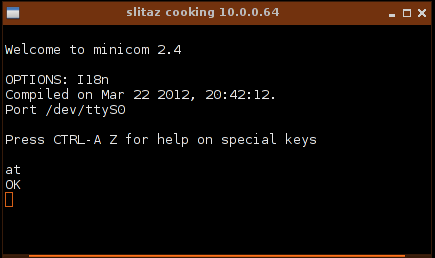

.. http://doc.slitaz.org/en:handbook:pstn
.. en/handbook/pstn.txt · Last modified: 2012/04/04 00:11 by linea

.. _handbook pstn:

PSTN
====

:author: domcox, linea

Introduction
------------

Dial-up connections use analog modems to transmit digital signals over traditional copper phone lines.
These connections require no infrastructure other than the telephone network.

* Dial-up is often the only choice available for rural or remote areas where broadband installations do not exist.
* In case of broadband failure, power outage or governments shutting down internet access and cellphone networks, (already happened in several countries) dial-up is a way to get back on-line.
* Where telephone access is widely available, dial-up remains an option to travellers.

Modem choice
------------

.. rubric:: Software modem

Any notebook modem is almost certainly a **software modem** and needs a specific driver.
The biggest problem users may have with notebook modems is unsupported drivers and this is not specific to Linux: many vendors have disappeared since the launch of Win98/XP, and no drivers have been developed for these old modems to work with Windows Vista or later, and don't expect a 64bit driver.
Modems that fall into this category include most Diamond modems (manufacturer gone out of business), most PCTel modems, many Smartlink modems, many Motorola modems, some USR modems, as well as some modems based upon chipsets from Conexant, and Agere.

Linux may provide support drivers for software modems.
Though there are a few software modems that you can find drivers for and in general as these drivers are not free software, installation or packaging is far from being an easy task.

.. rubric:: Hardware modem

Full **hardware modems** normally work "out of the box" with Linux, including Slitaz GNU/Linux.
There is no need to install drivers for such a modem in Slitaz GNU/Linux as they are already provided.
Hardware modems can be an internal device (PCI slot), an expansion card (PCMCIA, card-express) or an external peripheral connected to one of the serial or USB ports.

.. rubric:: Internal vs External

Note: Although the DC voltage in telephone lines does not cause immediate danger to the user, the AC ring signal (70-120V AC) can still give a nasty shock.
Moreover, telephone wires are also exposed to many different environmental effects (nearby lightning, ground potential differences in buildings, interference from power lines) which can sometimes cause high voltage spikes on the telephone wires that may damage your modem.
It happened to my modem and I found it easier and cheaper to change an external modem than to replace a full motherboard.

Modem installation
------------------

.. rubric:: Software modem

Software modems will work under Linux only if a driver exists and gets installed.
Slitaz offer several packages of drivers:

* :program:`linmodem-agrsm`: Agere Modem Drivers for 11c11040 chipsets
* :program:`linmodem-intel-536ep`: Intel Modem Drivers for 536EP chipset
* :program:`linmodem-intel-537`: Intel Modem Drivers for 537 chipsets
* :program:`linmodem-slmodem`: Drivers for the Smartlink winmodems

First, you have to identify the modem's chipset, then select the driver that fits your software modem.
You'll find valuable help at:

* http://www.tldp.org/HOWTO/Modem-HOWTO.html
* http://linmodems.technion.ac.il/Linmodem-howto.html
* http://linmodems.org/

.. rubric:: PCMCIA modem

If you want to use a PCMCIA Modem card, you have to install the driver for PCMCIA serial devices:

.. code-block:: console

   # tazpkg get-install linux-dialup

When you insert the PCMCIA modem, the driver will generally attempt to allocate the first unused serial device used by the card.
This command will tell you the device allocated:

.. code-block:: console

   # dmesg | tail

.. code-block:: console

   $ dmesg | tail -3
   pcmcia 0.1: pcmcia: registering new device pcmcia0.1 (IRQ: 3)
   serial_cs 0.1: trying to set up [0x0101:0x0556] (pfc: 0, multi: 1, quirk:   (null))
   serial8250: ttyS0 at I/O 0x3f8 (irq = 3) is a 16550A

.. rubric:: Serial port configuration

All modems, hardware or software modems with the appropriate driver loaded are reached using serial ports.
The serial port is either a regular port on your system or provided hard-wired as part of an internal-modem card.
In all cases, to communicate with your modem, Slitaz GNU/Linux needs only to communicate with the serial port.

PC systems accept up to 4 regular serial ports:

=== ========== ====== ===
Num   Device    Port  Irq
=== ========== ====== ===
 1  /dev/ttyS0 0x03f8  4
 2  /dev/ttyS1 0x02f8  3
 3  /dev/ttyS2 0x03e8  4
 4  /dev/ttyS3 0x02e8  3
=== ========== ====== ===

Software modems may add exotic devices to your system like :file:`/dev/ttyAGS3`, :file:`/dev/536ep`, :file:`/dev/ttySL0`…

In order to test the modem, we first need to configure the serial device.
Install :program:`setserial`:

.. code-block:: console

   # tazpkg get-install setserial

.. compound::
   And type:

   .. code-block:: console

      # setserial /dev/<serial_device> irq <ii> port <0xzz> autoconfig auto_irq

   with the proper values for the serial device, irq and port.

Then install the :program:`minicom` package:

.. code-block:: console

   # tazpkg get-install minicom

Then as root, open an :program:`XTerm` and type in:

.. code-block:: console

   # minicom -c on /dev/<serial_device> -o

Once :program:`minicom` is up, type::

  AT

Your modem should answer::

  OK

If your modem doesn't send a response, try another device (or maybe your serial device is badly configured), you'll find help at:

* http://www.tldp.org/HOWTO/html_single/Serial-HOWTO
* http://www.tldp.org/HOWTO/html_single/Modem-HOWTO

.. tip::
   Once you have a valid and tested connection to your modem; to simplify future operations it's recommended to create a symbolic link from the serial device connected to your modem to :file:`/dev/modem`:

   .. code-block:: console

      # ln -s /dev/ttyS0 /dev/modem

Connect the modem to the phone line
-----------------------------------

.. rubric:: Connect to the telephone wiring

The modem must be connected to an analog telephone line.
In some countries, a country-specific modem cable adapter is also required.
Jacks for digital PBX systems may resemble analog telephone jacks, but they are not compatible with the modem.

Pay attention to the different kinds of phone lines: analog and ISDN.
You can't connect an analog modem to an ISDN port and vice versa.
Connecting to the wrong port may even destroy your modem.
If your machine features an internal modem as well as an internal ethernet card, also pay attention to plug the right cable into the plug.
Otherwise you may easily damage your hardware.

.. rubric:: Handling different country standards

Telephone signalling (dial tone, engaged signal, etc) and DC current regulators options are specific to a particular country.
The modem needs to recognise each of these to be able to respond accordingly.
Your phone line needs a DC current of 25 to 35mA for a working phone.
In some countries the DC current regulator is located in the telephone exchange at the Central Office, but in other countries it's in the telephone set so if you do not properly set the country in which you operate your modem, you risk plugging in your modem to a phone line with no regulator at all and too much DC current (or both regulators and a too low DC current).
In both cases, you won't have a reliable connection and could even run the risk of destroying your modem if the DC current is too high.

If you bought and operate a hardware modem in the country where you live, it's not an issue as you can make some assumptions as to that it will meet the national specifications.

Old hardware modems were specific to a particular country.
But if you operate a software modem or you're a traveller, you have to set up your modem according to the country you are in.
Fortunately, most modems currently in use can be programmed to be used with any country's phone system.

.. tip::
   Commands for listing or setting up Country codes are specific to your modem or manufacturer so you just have to refer to the manual of your modem.
   The :ref:`country-codes <handbook pstn countries>` page will help you set up the correct country code.

Configure and Use a Dial-Up Connection
--------------------------------------

Launch the Slitaz Netbox Manager from the System tools menu or via a terminal:

.. code-block:: console

   $ subox netbox

.. rubric:: ppp-on file

Select the :guilabel:`ppp` tab, then click on the :guilabel:`Tune` Button.
Go to to the end of the file and change ``/dev/ttyS0`` to ``/dev/modem`` and set the speed to 115200 bds.
These settings usually work but you may need to set specific values according to your modem setup.

.. code-block:: console

   # exec /usr/sbin/pppd debug lock modem crtscts /dev/modem 115200 \
           asyncmap 20A0000 escape FF kdebug 0 $LOCAL_IP:$REMOTE_IP \
           noipdefault netmask $NETMASK defaultroute connect $DIALER_SCRIPT

.. rubric:: DNS

If you add the option ``usepeerdns``, the peer will ask for up to 2 DNS server addresses.
The addresses supplied by the peer (if any) are processed by the :file:`/etc/ppp/ip-up` script and the :file:`/etc/resolv.conf` updated with the address(es) supplied by the peer.
Otherwise, simply enter the address of a well known DNS server like OpenDNS in :file:`/etc/resolv.conf`::

  nameserver 208.67.222.222
  nameserver 208.67.220.220

.. rubric:: chat file

If you need to send a specific init option to your modem before starting :program:`ppp`, edit the :file:`/etc/ppp/scripts/ppp-on-dialer` file.
Add the new string before ``OK   ATDT$TELEPHONE``:

.. code-block:: shell
   :emphasize-lines: 9

   exec chat -v                                            \
           TIMEOUT         3                               \
           ABORT           '\nBUSY\r'                      \
           ABORT           '\nNO ANSWER\r'                 \
           ABORT           '\nRINGING\r\n\r\nRINGING\r'    \
           ''              \rAT                            \
           'OK-+++\c-OK'   ATH0                            \
           TIMEOUT         30                              \
           OK              ATL1+GCI=20                     \
           OK              ATDT$TELEPHONE                  \
           CONNECT         ''                              \
           ogin:--ogin:    $ACCOUNT                        \
           assword:        $PASSWORD

This file is a chat program designed to connect the user with a standard UNIX style getty/login connection.
For calling an ISP from a dial-out machine you need in most cases to delete the last two lines:

.. code-block:: shell

   exec chat -v                                            \
           TIMEOUT         3                               \
           ABORT           '\nBUSY\r'                      \
           ABORT           '\nNO ANSWER\r'                 \
           ABORT           '\nRINGING\r\n\r\nRINGING\r'    \
           ''              \rAT                            \
           'OK-+++\c-OK'   ATH0                            \
           TIMEOUT         30                              \
           OK              ATDT$TELEPHONE                  \
           CONNECT         \c

Save the file.

.. rubric:: Start connection

Enter your Login/password and Telephone number of your ISP in the corresponding fields, then select the :guilabel:`Start` button.
The modem should dial your Internet Provider.

.. rubric:: debug

As :program:`pppd` is started with a debug option, you can see the debug log.
Enter:

.. code-block:: console

   $ tail -f /var/log/messages

Sample output:

.. code-block:: console

   $ tail -f /var/log/messages
   Mar 23 11:25:29 (none) daemon.notice pppd[6240]: pppd 2.4.5 started by root, uid 0
   Mar 23 11:25:30 (none) local2.info chat[6242]: timeout set to 3 seconds
   Mar 23 11:25:30 (none) local2.info chat[6242]: abort on (\nBUSY\r)
   Mar 23 11:25:30 (none) local2.info chat[6242]: abort on (\nNO ANSWER\r)
   Mar 23 11:25:30 (none) local2.info chat[6242]: abort on (\nRINGING\r\n\r\nRINGING\r)
   Mar 23 11:25:30 (none) local2.info chat[6242]: send (rAT^M)
   Mar 23 11:25:30 (none) local2.info chat[6242]: expect (OK)
   Mar 23 11:25:31 (none) local2.info chat[6242]: rAT^M^M
   Mar 23 11:25:31 (none) local2.info chat[6242]: OK
   Mar 23 11:25:31 (none) local2.info chat[6242]:  -- got it
   Mar 23 11:25:31 (none) local2.info chat[6242]: send (ATH0^M)
   Mar 23 11:25:31 (none) local2.info chat[6242]: timeout set to 30 seconds
   Mar 23 11:25:31 (none) local2.info chat[6242]: expect (OK)
   Mar 23 11:25:31 (none) local2.info chat[6242]: ^M
   Mar 23 11:25:31 (none) local2.info chat[6242]: ATH0^M^M
   Mar 23 11:25:31 (none) local2.info chat[6242]: OK
   Mar 23 11:25:31 (none) local2.info chat[6242]:  -- got it
   Mar 23 11:25:31 (none) local2.info chat[6242]: send (ATZ^M)
   Mar 23 11:25:31 (none) local2.info chat[6242]: expect (OK)
   Mar 23 11:25:31 (none) local2.info chat[6242]: ^M
   Mar 23 11:25:31 (none) local2.info chat[6242]: ATZ^M^M
   Mar 23 11:25:31 (none) local2.info chat[6242]: OK
   Mar 23 11:25:31 (none) local2.info chat[6242]:  -- got it
   Mar 23 11:25:31 (none) local2.info chat[6242]: send (ATDT0860922000^M)
   Mar 23 11:25:31 (none) local2.info chat[6242]: expect (CONNECT)
   Mar 23 11:25:31 (none) local2.info chat[6242]: ^M
   Mar 23 11:25:56 (none) local2.info chat[6242]: ATDTxxxxxxx^M^M
   Mar 23 11:25:56 (none) local2.info chat[6242]: CONNECT
