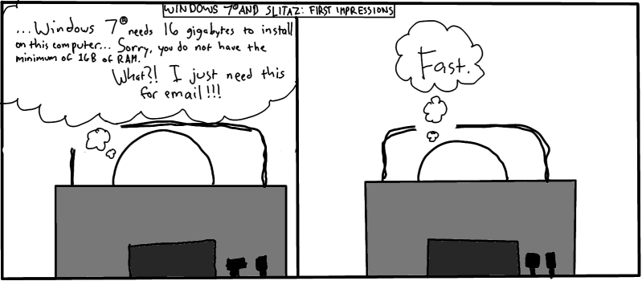

.. http://doc.slitaz.org/en:newsletter:oldissues:15
.. en/newsletter/oldissues/15.txt · Last modified: 2011/12/13 20:19 by godane

Issue 15
========

* Written on 27th February 2010

.. rubric:: Latest News

* SliTaz Cooking 20100221 released
* Newsletter translated into Chinese (thanks draplater)

.. rubric:: New Packages

.. hlist::
   :columns: 3

   * vim-tiny
   * smbfs
   * libsasl
   * libsasl-modules
   * libcomerr3
   * libkrb5support
   * cgdb
   * ccache
   * distcc
   * xorg-xf86-input-evtouch
   * xorg-xf86-input-microtouch
   * xorg-xf86-input-mutouch
   * open-iscsi
   * liblzma
   * pidgin-libnotify
   * xfce4-taskmanager
   * xfce4-ristretto
   * parole
   * xfmpc
   * xorg-xf86-input-void
   * hal-scripts
   * xorg-xf86-input-plpevtouch
   * xfmedia
   * dotconf
   * speech-dispatcher
   * yasr
   * ncdu
   * gfortran
   * libgfortran
   * octave
   * fusecloop
   * zsync
   * tinc
   * cloudvpn
   * antiword
   * l2tpd
   * rp-lstp
   * sctp-tools
   * libsctp
   * nat-tester
   * evilvte
   * lrzip
   * wipe
   * fsarchiver
   * perl-gd

.. rubric:: Updated Packages

.. hlist::
   :columns: 3

   * seamonkey ⇒ 2.0.2
   * ncmpcpp ⇒ 0.5
   * claws-mail-*
   * gtkhtkl-viewer ⇒ 0.26
   * rssyl ⇒ 0.26
   * vala ⇒ 0.7.9
   * mpd ⇒ 0.15.8
   * libxml2 ⇒ 2.7.6
   * mp ⇒ 5.1.3
   * scite ⇒ 2.01
   * beaver ⇒ 0.4.0rc1
   * xvkbd ⇒ 3.1
   * zim ⇒ 0.29
   * mplayer-svn ⇒ 30605
   * ntfs-3g ⇒ 2010.1.16
   * xterm ⇒ 255
   * lxpanel ⇒ 0.5.5

.. rubric:: Improvements

* tazlito (3.0) — Easier to customize LiveCD, GUI refactored, fixes and misc improvements
* slitaz-base-files (3.1) — 2 new scripts (man,ldd), OOO looks better and UTF-8
* slitaz-tools (3.5) — Better wifibox scan, UTF-8 locale with tazlocale, installer improved
* slitaz-doc (3.1) — Now provides a getting started guide

.. rubric:: Bugs

======== ==== ======
Activity Open Closed
======== ==== ======
Bugs      68    57
Features  36    24
Tasks      8    39
======== ==== ======

* Based on current figures

.. rubric:: Cartoon

.. rubric:: Tips and Tricks

* `How do I run a remote Linux desktop in Windows 7 <https://web.archive.org/web/20100402111607/http://blogs.techrepublic.com.com/window-on-windows/?p=2138>`_

.. rubric:: Online

* `SliTaz Guide for survival (Live Linux) CD USB flash <http://www.fixya.com/support/r3885135-slitaz_guide_survival_live_linux_cd_usb>`_
