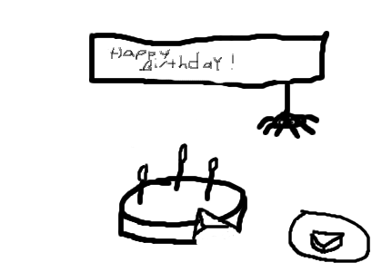

.. http://doc.slitaz.org/en:newsletter:oldissues:16
.. en/newsletter/oldissues/16.txt · Last modified: 2011/12/13 20:19 by godane

Issue 16
========

* Written on 5th April 2010

.. rubric:: Latest News

* SliTaz version 3.0 released

.. rubric:: New Packages

.. hlist::
   :columns: 3

   * busybox-static
   * httpfs-fuse-static
   * ctags
   * nss
   * yad
   * xorg-xf86-video-openchrome
   * samba-common
   * vym
   * perl-net-xwhois
   * rgzip
   * sslh

.. rubric:: Updated Packages

.. hlist::
   :columns: 3

   * ntfs-3g ⇒ 2010.1.16
   * tor ⇒ 2.1.23
   * lxpanel ⇒ 0.5.5
   * task ⇒ 1.9.0
   * libgphoto2 ⇒ 2.4.8
   * libsoup ⇒ 2.29.91
   * mplayer-svn ⇒ 30817
   * libdevmapper ⇒ 1.02.44
   * cryptsetup ⇒ 1.1.0
   * bluez ⇒ 4.62
   * midori ⇒ 0.2.4
   * wvdial ⇒ 1.61
   * ppp-* ⇒ 2.4.5
   * squid ⇒ STABLE25
   * xorg-xf86-video-intel ⇒ 2.7.1
   * privoxy ⇒ 3.0.16-stable
   * sudo ⇒ 1.7.2p5
   * lighttpd ⇒ 1.4.26
   * openssh ⇒ 5.4p1
   * sftp-server ⇒ 5.4p1
   * xterm ⇒ 256
   * nano ⇒ 2.2.3
   * isomaster ⇒ 1.3.7
   * mhwaveedit ⇒ 1.4.18
   * gtk-gnutella ⇒ 0.96.8

.. rubric:: Improvements

* tazlito (3.2) — box can now generate loram and loram/web
* slitaz-base-files (3.2) — release notes added
* slitaz-tools (3.8) — many improvements, po edits and fixes
* slitaz-doc (3.2) — release notes updated
* slitaz-boot-scripts (3.2) — updated
* slitaz-configs — small improvements
* slitaz-dev-tools — updated
* tazusb — ext2 and fat32 formatting added
* tazpkg — gui improvements and bug fixes

.. rubric:: Bugs

======== ==== ======
Activity Open Closed
======== ==== ======
Bugs      85    73
Features  35    29
Tasks     26    43
======== ==== ======

* Based on current figures

.. rubric:: Cartoon

.. rubric:: Tips and Tricks

* `A System Monitoring Tool Primer <https://web.archive.org/web/20100506120002/http://www.certcities.com/editorial/columns/story.asp?EditorialsID=413>`_

.. rubric:: Online

* `Greetings from SliTaz 3.0 <http://kmandla.wordpress.com/2010/03/29/greetings-from-slitaz-3-0/>`_
