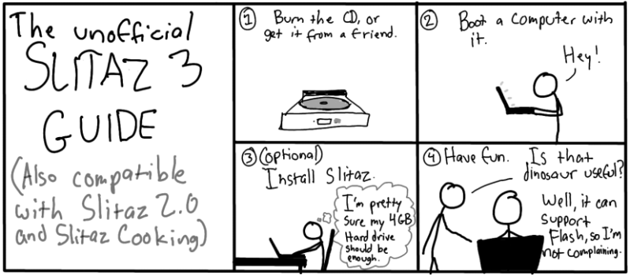

.. http://doc.slitaz.org/en:newsletter:oldissues:17
.. en/newsletter/oldissues/17.txt · Last modified: 2011/12/13 20:20 by godane

Issue 17
========

* Written on 9th May 2010

.. rubric:: Latest News

* SliTaz 'Summer of Documentation'

.. rubric:: New Packages

.. hlist::
   :columns: 3

   * aria2
   * exo
   * gtkperf
   * liblinebreak
   * fbreader
   * enigma
   * xfce4-notification
   * mountlo
   * speedometer
   * python-urwid
   * geequie
   * mpc-library
   * cmatrix
   * ffmpeg-svn
   * get-prince
   * get-msttcorefonts
   * gen-init-cpio
   * wikiss
   * groff
   * linmodem-hsfmodem

.. rubric:: Updated Packages

.. hlist::
   :columns: 3

   * evilvte ⇒ 0.4.6
   * yad ⇒ 0.2.0
   * freetype ⇒ 2.3.12
   * lrzip ⇒ 0.45
   * mpfr ⇒ 2.4.2
   * gmp ⇒ 4.3.2
   * binutils ⇒ 2.20.1
   * linux ⇒ 2.6.33.2
   * libbfd ⇒ 2.20.1
   * gcc ⇒ 4.5.0
   * glibc ⇒ 2.11.1
   * broadcom-wl ⇒ 5.60.48.36
   * pixman ⇒ 0.16.0
   * vala ⇒ 0.7.10
   * libgmp ⇒ 4.5.0
   * autoconf ⇒ 2.65
   * coreutils ⇒ 8.4
   * dillo ⇒ 2.2
   * lxtask ⇒ 0.1.3
   * bison ⇒ 2.4.2
   * cmake ⇒ 2.6.4
   * cpio ⇒ 2.11
   * libxml2 ⇒ 2.7.7
   * abiword ⇒ 2.8.4
   * libart-lgpl ⇒ 2.3.21
   * mpd ⇒ 0.15.9
   * ncmpcpp ⇒ 0.5.3
   * dstat ⇒ 0.7.1
   * openssl ⇒ 1.0.0
   * openssh ⇒ 5.5p1
   * libssl ⇒ 1.0.0
   * xorg-\*proto ⇒ 1.2.0
   * libcrypto ⇒ 1.0.0
   * libdrm ⇒ 2.4.20
   * xorg-lib\* ⇒ various
   * mesa ⇒ 7.8.1
   * xorg-server ⇒ 1.8.0
   * sftp-server ⇒ 5.5p1
   * ndiswrapper ⇒ 1.56
   * xorg-\* ⇒ various
   * xorg-xf86-video-\* ⇒ various
   * zile ⇒ 2.3.15
   * kismet ⇒ 2010-01-R1
   * emacs-pkg-lua-mode ⇒ 20100404
   * hal-info ⇒ 20091130
   * libedit ⇒ 3.0
   * pm-utils ⇒ 1.2.6.1
   * boxbackup-\* ⇒ 0.11rc8
   * curl ⇒ 7.20.1
   * wine ⇒ 1.1.43
   * sylpheed ⇒ 3.0.2
   * cairo ⇒ 1.8.10
   * nvidia ⇒ 195.36
   * linmodem ⇒ 2.1.80~20091225
   * fuse ⇒ 2.8.4
   * git ⇒ 1.7.1
   * vlc ⇒ 1.0.6
   * ffmpeg ⇒ 0.5.1
   * mercurial ⇒ 1.5.2
   * subversion ⇒ 1.6.11
   * zlib ⇒ 1.2.5
   * sqlite ⇒ 3.6.23.1
   * tcl ⇒ 8.5.8
   * conky ⇒ 1.8.0
   * audacity ⇒ 1.3.12
   * asunder ⇒ 1.9.3
   * grsync ⇒ 1.1.0
   * audiofile ⇒ 0.2.7
   * lguest ⇒ 2.6.33.2
   * libwebkit ⇒ 1.2.0
   * webkit-web-inspector ⇒ 1.2.0
   * parted ⇒ 2.2
   * gparted ⇒ 0.5.2
   * grub2 ⇒ 1.98
   * cmake ⇒ 2.8.1
   * glib ⇒ 2.25.2
   * libgio ⇒ 2.25.2
   * pango ⇒ 1.28.0
   * bazaar ⇒ 2.1.0
   * avidemux ⇒ 2.5.2
   * cdrkit ⇒ 1.1.10
   * readom ⇒ 1.1.10
   * atk ⇒ 1.30.0
   * aircrack-ng ⇒ 1.1
   * gtk+ ⇒ 2.20.1
   * firefox ⇒ 3.6.3
   * irssi ⇒ 0.8.15
   * bluefish ⇒ 2.0.0
   * btrfs-progs ⇒ 0.19
   * libtool ⇒ 2.2.6b
   * e2fsprogs ⇒ 1.41.11
   * menu-cache ⇒ 0.3.2
   * openbox ⇒ 3.4.11.1
   * mtpaint ⇒ 3.31
   * clamav ⇒ 0.96
   * tor ⇒ 0.2.1.26
   * openal ⇒ 1.2.854
   * bzip2 ⇒ 1.0.5
   * bzlib ⇒ 1.0.5
   * gaijim ⇒ 0.13.4
   * gtkpod ⇒ 0.9.16
   * neon ⇒ 0.29.3
   * bind ⇒ 9.7.0-P1
   * goffice ⇒ 0.8.2
   * libgsf ⇒ 1.14.16
   * transmission-\* ⇒ 1.93
   * glibmm ⇒ 2.24.2
   * libgiomm ⇒ 2.24.2
   * cariomm ⇒ 1.8.4
   * pangomm ⇒ 2.26.2
   * gtkmm ⇒ 2.20.3
   * pkg-config ⇒ 0.23
   * pmount ⇒ 0.9.20
   * gnutls ⇒ 2.8.6
   * perl-net-ssleay ⇒ 1.36
   * dahdi-\* ⇒ 2.3.0
   * x11vnc-\* ⇒ 0.9.10
   * asterisk ⇒ 1.6.2.7
   * diffutils ⇒ 3.0
   * cups-pam ⇒ 1.4.2
   * davfs2 ⇒ 1.4.6
   * ruby ⇒ 1.9.1
   * ptlib ⇒ 2.6.5
   * opal ⇒ 3.6.6
   * ekiga ⇒ 3.2.6
   * seamonkey ⇒ 2.0.4
   * linmodem-slmodem ⇒ 2.9.11-20100303
   * depmod ⇒ 3.11.1
   * module-init-tools ⇒ 3.11.1
   * patch ⇒ 2.6.1
   * wireshark ⇒ 1.2.8
   * testdisk ⇒ 6.11.3
   * file ⇒ 5.04
   * libmagic ⇒ 5.04
   * pidgin ⇒ 2.6.6
   * claws-mail-\* ⇒ various
   * gtkhtml2-viewer ⇒ 2.27
   * rssl ⇒ 0.27

.. rubric:: Improvements

* New toolchain
* tazwok updated (3.2)

.. rubric:: Bugs

======== ==== ======
Activity Open Closed
======== ==== ======
Bugs      94    73
Features  37    29
Tasks     27    43
======== ==== ======

* Based on current figures 

.. rubric:: Cartoon

.. rubric:: Tips and Tricks

* `How-To: Grep Tricks for Linux Users <http://www.itworld.com/it-managementstrategy/106032/how-to-grep-tricks-linux-users>`_

.. rubric:: Online

* `SliTaz Linux 3.0 lends credence to the phrase “Small but Powerful” <https://web.archive.org/web/20100404015556/http://www.linuxcritic.com:80/slitaz-linux-30-lends-credence-phrase-small-powerful/>`_
