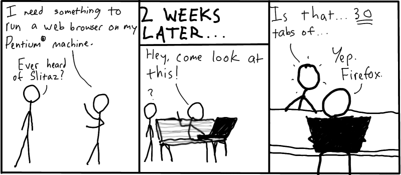

.. http://doc.slitaz.org/en:newsletter:oldissues:22
.. en/newsletter/oldissues/22.txt · Last modified: 2011/12/13 21:35 by godane

Issue 22
========

:author: linea, godane

* Written on 30th January 2011

.. rubric:: Latest News

* Website, Wiki, Labs updated
* Newsletter translated into Spanish (thanks seacat)

.. rubric:: New Packages

.. hlist::
   :columns: 3

   * ecm
   * mdk3
   * airoscript-ng
   * php-dbase
   * pycurl
   * pidgin-musictracker
   * linapple
   * dvgrab
   * ogmrip
   * at
   * chntpw
   * disktype
   * fakeroot
   * xorg-xf86-input-vmmouse
   * caps
   * alsaequal
   * linux-without-modules
   * TeXmacs
   * bzflag
   * pysqlite
   * celestia
   * perl-libwww
   * pyrex
   * pywebkitgtk
   * pyorbit
   * gnome-mime-data
   * php-soap
   * phpvirtualbox
   * libmicrohttpd
   * gnome-vfs
   * fcitx-zm
   * gnome-python
   * miro
   * clisp
   * cowpatty
   * asleap
   * scrub
   * postfixadmin
   * igmpproxy
   * wyrd
   * pktstat
   * get-LibreOffice
   * weechat
   * qrencode
   * phpqrcode
   * perl-smtp-ssl
   * cairo-dock
   * cairo-dock-plugins
   * gambas2
   * util-linux-ng-setterm
   * yajl
   * urlgrabber
   * perl-text-csv
   * polkit
   * garcon
   * libxfce4ui
   * gzip
   * vzctl
   * vzquota
   * thunar-vfs
   * ovz-web-panel
   * sqlite3-ruby
   * xorg-makedepend
   * libQtTest
   * libssh
   * openmpi
   * shellinabox
   * freerdp
   * remminia

.. rubric:: Updated Packages (abridged)

.. hlist::
   :columns: 3

   * scribus ⇒ 1.3.9
   * libogg ⇒ 1.2.2
   * gpodder ⇒ 2.12
   * gnutls ⇒ 2.10.4
   * feh ⇒ 1.11
   * xterm ⇒ 267
   * gst-plugins-good ⇒ 0.10.26
   * cairomm ⇒ 1.8.6
   * lvm2 ⇒ 2.02.81
   * clutter-gtk ⇒ 0.10.8
   * aria2 ⇒ 1.10.9
   * fotoxx ⇒ 11.01
   * whois ⇒ 5.0.10
   * py3k ⇒ 3.1.3
   * firefox ⇒ 3.6.13
   * seamonkey ⇒ 2.0.11
   * thunderbird ⇒ 3.1.7
   * audacious ⇒ 2.4.3
   * transmission ⇒ 2.13
   * nasm ⇒ 2.09.04
   * cherokee ⇒ 1.0.18
   * libisofs ⇒ 0.6.40
   * libburn ⇒ 0.9.0
   * dhcp ⇒ 4.2.0-P2
   * pcre ⇒ 8.12
   * sqlite ⇒ 3.7.4
   * php ⇒ 5.2.17
   * docbook-xsl ⇒ 1.76.1
   * zenity ⇒ 2.32.1
   * gparted ⇒ 0.7.1
   * xorg-server ⇒ 1.9.3
   * buildbot ⇒ 0.8.2
   * beautifulsoup ⇒ 3.2.0
   * e2fsprogs ⇒ 1.41.14
   * mixxx ⇒ 1.8.2
   * curl ⇒ 7.21.3
   * mysql ⇒ 5.1.54
   * postgresql ⇒ 9.0.2
   * postfix ⇒ 2.8.0
   * freeciv ⇒ 2.2.4
   * git ⇒ 1.7.3.5
   * viewnoir ⇒ 1.1
   * drupal ⇒ 6.20
   * scite ⇒ 2.23
   * udev ⇒ 1.6.5
   * libdrm ⇒ 2.4.23
   * terminal ⇒ 0.4.5
   * evilvte ⇒ 0.4.7
   * bogofilter ⇒ 1.2.2
   * bluez ⇒ 4.82
   * pyneighborhood ⇒ 0.5.3
   * lmms ⇒ 0.4.9
   * wipe ⇒ 2.3.1
   * tor ⇒ 0.2.1.29
   * pidgin ⇒ 2.7.9
   * leafpad ⇒ 0.8.18.1
   * zsh ⇒ 4.3.11
   * snort ⇒ 2.9.0.3
   * parcellite ⇒ 0.9.3
   * busybox ⇒ 1.18.2
   * netatalk ⇒ 2.1.5
   * lvm2 ⇒ 2.02.79
   * winetricks ⇒ 20110123
   * ethtool ⇒ 2.6.36
   * speedometer ⇒ 2.7
   * task ⇒ 1.9.3
   * units ⇒ 1.88
   * cryptsetup ⇒ 1.2.0
   * deadbeef ⇒ 0.4.4
   * exiv ⇒ 0.20
   * zile ⇒ 2.3.21
   * sip ⇒ 4.12
   * fsarchiver ⇒ 0.6.12
   * ruby ⇒ 1.9.2-p136
   * mc ⇒ 4.7.5
   * vala ⇒ 0.10.2
   * mercurial ⇒ 1.7.3
   * wordpress ⇒ 3.0.4
   * elfutils ⇒ 0.151
   * yad ⇒ 0.7.2
   * libwebkit ⇒ 1.2.6
   * rrdtool ⇒ 1.4.5
   * htop ⇒ 0.9
   * cups ⇒ 1.4.6
   * geany ⇒ 0.20
   * shell-fm ⇒ 0.7
   * bash ⇒ 4.1
   * module-init-tools ⇒ 1.12
   * make ⇒ 3.82
   * coreutils ⇒ 0.9
   * isomaster ⇒ 1.3.8
   * ncmpcpp ⇒ 0.5.6
   * sudo ⇒ 1.7.4p5
   * wireshark ⇒ 1.4.3
   * nicotine ⇒ 1.2.16
   * mlt ⇒ 0.6.0
   * mpc ⇒ 0.20
   * gnupg ⇒ 2.0.17
   * dbus ⇒ 1.4.1
   * file ⇒ 5.0.5
   * exo ⇒ 0.6.0
   * xfce4-* ⇒ 4.8.0
   * dmidecode ⇒ 2.11
   * gst-plugins-{good, bad, base, ugly} ⇒ 0.10.*
   * libdrm ⇒ 2.4.23
   * mesa ⇒ 7.10
   * linux ⇒ 2.6.37
   * aufs ⇒ 20110122
   * catalyst ⇒ 10.12
   * orage ⇒ 4.8.0
   * kismet ⇒ 2011-01-R1
   * murrine ⇒ 2011-01-R1
   * ntfs-3g ⇒ 2011.1.15
   * vlc ⇒ 1.1.6
   * openssh ⇒ 5.7p1
   * memtest ⇒ 4.20
   * inkscape ⇒ 0.48.1
   * nmap ⇒ 5.10
   * ddrescue ⇒ 1.14
   * xz ⇒ 5.0.1
   * mplayer ⇒ 1.0rc4
   * xorg-xproto ⇒ 7.0.20

.. rubric:: Improvements

* slitaz-configs-base added (4.0) 
* slitaz-tools (4.0.2)
* slitaz-boot-scripts (3.4.3.1)
* slitaz-configs (4.1)
* slitaz-base-files (4.1.2)
* tazpkg (4.2.3)
* tazlito (3.3)
* tazchroot (0.0.4)
* libtaz (0.0.4)

.. rubric:: Bugs

======== ==== ======
Activity Open Closed
======== ==== ======
Bugs     102   118
Features  44    43
Tasks     22    79
======== ==== ======

* Based on current figures

.. rubric:: Cartoon

.. rubric:: Tips and Tricks

* `Python for Newbies – Part1 <http://temporaryland.wordpress.com/2011/01/26/python-for-newbies/>`_

.. rubric:: Online

* `Install the SliTaz operating system in VirtualBox <http://www.unixweblog.com/2011/01/installing-linux-slitaz-small-30-mb-linux-operating-system-in-virtualbox/>`_
  (broken link and also missing on `web.archive.org <https://web.archive.org/web/*/http://www.unixweblog.com/2011/01/installing-linux-slitaz-small-30-mb-linux-operating-system-in-virtualbox>`_)
