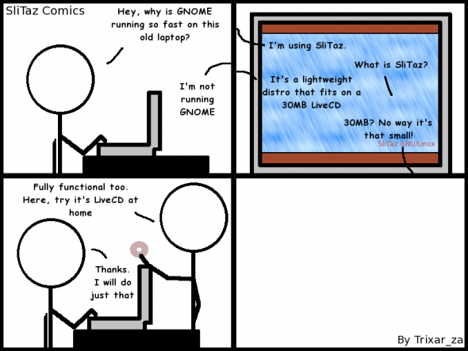

.. http://doc.slitaz.org/en:newsletter:oldissues:25
.. en/newsletter/oldissues/25.txt · Last modified: 2011/10/09 17:46 by linea

Issue 25
========

* Written on 28th July 2011

.. rubric:: Latest News

* Wok currently frozen for RC series

.. rubric:: New Packages

.. hlist::
   :columns: 3

   * idesk
   * libmatchbox
   * lsyncd
   * dia
   * ssfs
   * ssfs-busybox
   * luasocket
   * zbar
   * lxc
   * iptraf
   * keychain

.. rubric:: Updated Packages

.. hlist::
   :columns: 3

   * mcabber-help ⇒ 0.9.10
   * gob2-dev ⇒ 2.0.17
   * ntop ⇒ 4.0.3
   * ImageMagick ⇒ 6.7.0
   * wakoopa ⇒ 2.0-2
   * ncmpc ⇒ 0.19

.. rubric:: Improvements

* slitaz tools (4.4.1)
* slitaz-boot-scripts (4.5)
* slitaz-base-files (4.4)
* slitaz-configs (4.4)
* slitaz-doc (4.2)
* tazpanel (1.1)
* cookutils (1.4)
* tazwikiss (1.3)
* tazdev (1.3)
* tazdrop (4.4)

.. rubric:: Bugs

======== ==== ======
Activity Open Closed
======== ==== ======
Critical   8     4
Standard  20    13
Feature    5     1
Task      11     9
======== ==== ======

* Based on current figures

.. rubric:: Cartoon

.. rubric:: Tips and Tricks

* `Corntab <https://web.archive.org/web/20110629014422/http://www.corntab.com/pages/crontab-gui>`_

.. rubric:: Online

* `What's cooking? It's SliTaz <http://distrowatch.com/weekly.php?issue=20110620#feature>`_
