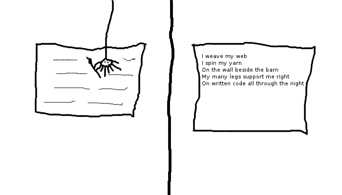

.. http://doc.slitaz.org/en:newsletter:oldissues:26
.. en/newsletter/oldissues/26.txt · Last modified: 2012/01/20 19:19 by linea

Issue 26
========

:author: linea

* Written on 9th October 2011

.. rubric:: Latest News

* Wok currently frozen for RC series

.. rubric:: New Packages

.. hlist::
   :columns: 3

   * posixovl
   * linmodem-slmodem
   * hdparm
   * opencc
   * fcitx-googlepinyin
   * libgooglepinyin
   * laptop-mode-tools
   * util-linux-ng-blockdev

.. rubric:: Updated Packages

.. hlist::
   :columns: 3

   * dokuwiki ⇒ 2011-05-25a
   * wordpress ⇒ 3.2.1
   * iron-linux ⇒ 13.0.800.0
   * xnviewmp ⇒ 0.39
   * apache ⇒ 2.2.21
   * wireshark ⇒ 1.6.2
   * zim ⇒ 0.53
   * fcitx ⇒ v4.1.2
   * fcitx-googlepinyin ⇒ v0.1.3

.. rubric:: Improvements

* tazwikiss (1.4)
* tazpkg (4.7.1)
* tazlito (4.2)

.. rubric:: Bugs

======== ==== ======
Activity Open Closed
======== ==== ======
Critical   7     6
Standard  28    15
Feature    6     2
Task      11     9
======== ==== ======

* Based on current figures

.. rubric:: Cartoon

.. rubric:: Tips and Tricks

* `Simple Iptables Script Generator <http://www.mista.nu/iptables/>`_

.. rubric:: Online

* `The SliTaz Experience <https://web.archive.org/web/20110805011916/http://rollingprogrammer.com:80/2011/06/26/the-slitaz-experience>`_
