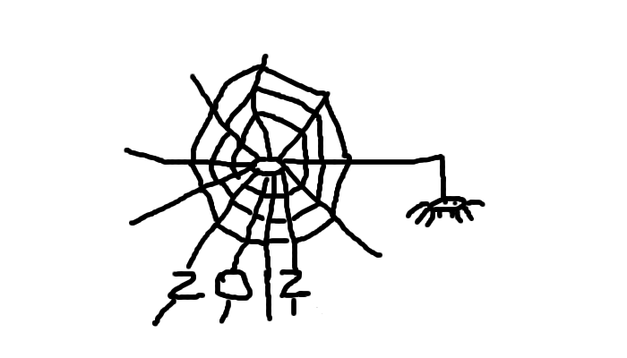

.. http://doc.slitaz.org/en:newsletter:oldissues:27
.. en/newsletter/oldissues/27.txt · Last modified: 2012/07/01 11:51 by linea

Issue 27
========

:author: linea

* Written on 20th January 2012

.. rubric:: Latest News

* Various updates and packages added to repos

.. rubric:: New Packages

.. hlist::
   :columns: 3

   * get-teamviewer
   * get-wifica
   * gsoap
   * arping
   * pciids
   * usbids
   * libdes
   * gnome-games
   * seed
   * fbvnc
   * novnc
   * sdcc
   * afpfs-ng
   * gnome-desktop
   * pamtester
   * rlwrap
   * qoauth
   * python-xlib
   * php-auth-pam
   * util-linux-ng-flock
   * tslib
   * swfdec
   * perl-net-pcap
   * net-tools
   * mspdebug
   * avant-window-navigator
   * apcupsd
   * alarm-clock
   * qca-ossl
   * brasero
   * blueman
   * bleachbit
   * blackbox
   * billardgl
   * ayttm
   * collectd
   * cdrtools
   * catfish
   * cairo-compmgr
   * buildroot
   * cssed
   * cpuspeed
   * cppunit
   * compiz
   * dovecot
   * distccmon-gui
   * directfb
   * dietlibc
   * dansguardian
   * fbpanel
   * ettercap
   * enet
   * editorbj
   * gvfs
   * guichan
   * gliv
   * ggseq
   * get-msttcorefonts
   * gejengel
   * gecko-mediaplayer
   * mana
   * lxdm
   * jnettop
   * ipcalc
   * icinga
   * muninlite
   * motion
   * moosefs
   * micro_proxy
   * mongodb
   * maxima
   * protobuf
   * oxine
   * owfs
   * ola
   * nvclock
   * ucarp
   * tp_smapi
   * thttpd
   * t2
   * soprano
   * songwrite
   * siproxd
   * rsbep
   * rdpdesk
   * radiotray
   * qtwitter
   * wput
   * wol
   * wammu
   * vsftpd
   * verbiste
   * mplayerplug-in
   * ucl
   * upx
   * less
   * libruby-extras
   * nettle
   * transmission-remote-gtk
   * p11-kit
   * gtk-doc
   * mypaint
   * protobuf-python
   * python-distribute
   * libraw
   * libee
   * libestr
   * liblognorm
   * libesmtp
   * sagan
   * barnyard2
   * snort-mysql
   * libhtp
   * yaml
   * libcap-ng
   * suricata
   * autoblog
   * flatpress
   * fwbuilder
   * get-nz
   * gtklp
   * haproxy
   * hardware-ibm-6272
   * hardware-thinkpad-600e
   * libextractor
   * matchbox
   * mp3gain
   * pcmanfm2
   * picoblog
   * pwnat
   * pysdm
   * ranger
   * ruby-gems
   * shaarli
   * tor-arm

.. rubric:: Updated Packages (abridged)

.. hlist::
   :columns: 3

   * scite ⇒ 2.29
   * python ⇒ 2.7.2
   * snort ⇒ 2.9.1.2
   * sudo ⇒ 1.8.3p1
   * gtk+ ⇒ 2.24.8
   * aria2 ⇒ 1.13.0
   * bluez ⇒ 2.96
   * bison ⇒ 2.5
   * at ⇒ 3.1.13
   * clamav ⇒ 0.97.3
   * tcl ⇒ 8.5.10
   * tk ⇒ 8.5.10
   * tree ⇒ 1.6.0
   * stellarium ⇒ 0.11.0
   * audacious ⇒ 3.0.4
   * inkscape ⇒ 0.48.2
   * git ⇒ 1.7.7.2
   * bazaar ⇒ 2.4.1
   * bzflag ⇒ 2.4.0
   * deadbeef ⇒ 0.5.1
   * grep ⇒ 2.9
   * py3k ⇒ 3.2.2
   * putty ⇒ 0.61
   * pciutils ⇒ 3.1.8
   * usbutils ⇒ 004
   * clamtk ⇒ 4.36
   * pekwm ⇒ 0.1.13
   * pcre ⇒ 8.13
   * pangomm ⇒ 2.28.4
   * pango ⇒ 1.29.4
   * pcmciautils ⇒ 018
   * openvpn ⇒ 2.2.1
   * openssh ⇒ 5.9p1
   * rsync ⇒ 3.0.9
   * bind ⇒ 9.8.1
   * bird ⇒ 1.3.4
   * calcurse ⇒ 2.9.2
   * claws-mail ⇒ 3.7.10
   * cmake ⇒ 2.8.5
   * dbus ⇒ 1.4.16
   * dhcp ⇒ 4.2.2
   * dialog ⇒ 1.1-20110707
   * drupal ⇒ 7.8
   * epdfview ⇒ 0.1.8
   * espeak ⇒ 1.45.05
   * fetchmail ⇒ 6.3.21
   * gpodder ⇒ 2.19
   * atkmm ⇒ 2.22.6
   * gtkmm ⇒ 2.24.2
   * youtube-dl ⇒ 2011.10.19
   * xz ⇒ 5.0.3
   * zsh ⇒ 4.3.12
   * xpad ⇒ 4.0
   * yad ⇒ 0.15.1
   * xterm ⇒ 276
   * wxpython ⇒ 2.8.12.1
   * wxWidgets ⇒ 2.8.12.1
   * wordwarvi ⇒ 1.00
   * wget ⇒ 1.13.4
   * vte ⇒ 0.28.2
   * rtorrent ⇒ 0.8.9
   * sqlite ⇒ 3.7.9
   * lame ⇒ 3.99
   * goffice ⇒ 0.8.17
   * gnumeric ⇒ 1.10.17
   * geany ⇒ 0.21
   * glib ⇒ 2.30.1
   * freetype ⇒ 2.4.7
   * filezilla ⇒ 3.5.1
   * acpid ⇒ 2.0.12
   * cherokee ⇒ 1.2.101
   * pcre ⇒ 8.20
   * pam ⇒ 1.1.5
   * gparted ⇒ 0.10.0
   * mercurial ⇒ 2.0
   * john ⇒ 1.7.8
   * curl ⇒ 7.22.0
   * tmux ⇒ 1.5
   * firefox ⇒ 8.0
   * gcompris ⇒ 11.09
   * midori ⇒ 0.4.1
   * lrzip ⇒ 0.608
   * gnutls ⇒ 3.0.7
   * tor ⇒ 0.2.2.34
   * vidalia ⇒ 0.2.15
   * bleachbit ⇒ 0.9.1
   * htop ⇒ 1.0
   * links ⇒ 2.4
   * ncdu ⇒ 1.8
   * seamonkey ⇒2.5
   * postgresql ⇒ 9.1.2
   * putty ⇒ 0.62
   * wireshark ⇒ 1.6.4 
   * xfsprogs ⇒ 3.1.7
   * ntop ⇒ 4.1.0
   * vlc ⇒ 1.1.13
   * scribus ⇒ 1.4.0
   * p0f ⇒ 3.01b

.. rubric:: Improvements

* tazpanel (1.2)
* tazpkg (4.7.2)
* tazwok (4.2.18)

.. rubric:: Bugs

======== ==== ======
Activity Open Closed
======== ==== ======
Critical   6     9
Standard  25    27
Feature    7     3
Task       8    12
======== ==== ======

* Based on current figures 

.. rubric:: Cartoon

.. rubric:: Tips and Tricks

* `What is the exact difference between a ‘terminal’, a ‘shell’, a ‘tty’ and a ‘console’? <http://linux-news.org/index.php/2011/10/19/what-is-the-exact-difference-between-a-terminal-a-shell-a-tty-and-a-console/>`_

.. rubric:: Online

* `Linux light - SliTaz GNU/Linux and SliTaz-Aircrack-ng <http://all-things-linux.blogspot.com/2011/10/linux-light-slitaz-gnulinux-and-slitaz.html>`_
